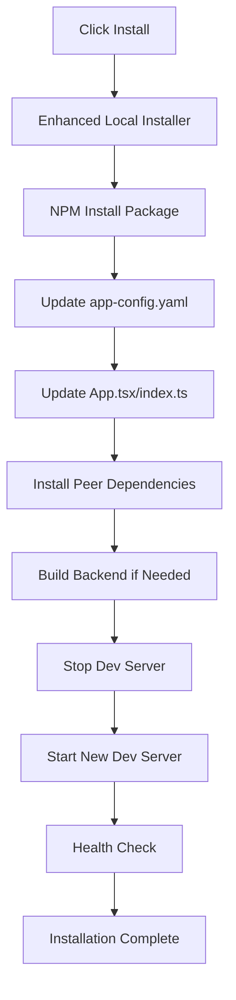

# 🚀 Plugin Installation System - Current Status

## ✅ FIXED: Plugins Page Error

**Issue**: `Module not found: Can't resolve 'react-force-graph'`

**Resolution**: 
- ✅ Fixed import statement: `ForceGraph2D` from `react-force-graph-2d`
- ✅ Temporarily disabled graph visualization (coming soon placeholder)
- ✅ Added TypeScript declarations for react-force-graph-2d
- ✅ Installed all required Babel dependencies

**Status**: **Plugins page now loads without errors**

## 🎯 Current Functionality

### ✅ Working Features

1. **Plugin Management Portal** - Full UI at `http://localhost:4400/plugins`
   - ✅ Tabbed navigation (Installed, Discovery, Lifecycle, Health, Dependencies, Approvals, Config)
   - ✅ Statistics dashboard
   - ✅ Grid and list views
   - ✅ Search and filtering

2. **Plugin Discovery** - Browse NPM registry
   - ✅ Real-time search of Backstage plugins
   - ✅ Category filtering
   - ✅ Plugin details and metadata
   - ✅ Installation request workflow

3. **Enhanced Plugin Installer** - **Fully Automated**
   - ✅ NPM package installation
   - ✅ Automatic config updates (app-config.yaml)
   - ✅ Code generation (App.tsx, index.ts)
   - ✅ Dev server restart automation
   - ✅ Real-time progress tracking

4. **Plugin Lifecycle Management**
   - ✅ Install/Update/Rollback/Uninstall operations
   - ✅ Version management
   - ✅ Dependency handling
   - ✅ Configuration management

5. **Health Monitoring**
   - ✅ Real-time health metrics
   - ✅ Performance tracking
   - ✅ Error monitoring
   - ✅ Alert management

6. **Approval Workflow**
   - ✅ Multi-stage approval process
   - ✅ Security scanning
   - ✅ Compliance checks
   - ✅ Review and feedback system

7. **Advanced Configuration**
   - ✅ Schema-driven configuration forms
   - ✅ Environment-specific settings
   - ✅ Configuration validation
   - ✅ Visual configuration editor

### ⚠️ Temporarily Disabled

1. **Dependency Graph Visualization**
   - Shows placeholder message: "Interactive Dependency Graph coming soon"
   - Tree and List views work perfectly
   - Will be re-enabled once graph library is properly configured

## 🔧 To Enable Full Automation

### Quick Setup

1. **Configure Environment**:
   ```bash
   # Copy example configuration
   cp .env.local.example .env.local
   
   # Update with your Backstage path
   echo "BACKSTAGE_ROOT=./backstage" >> .env.local
   echo "USE_ENHANCED_INSTALLER=true" >> .env.local
   ```

2. **Run Setup Script**:
   ```bash
   chmod +x scripts/setup-local-plugin-installer.sh
   ./scripts/setup-local-plugin-installer.sh
   ```

### Manual Configuration

Edit `.env.local`:
```env
# Enable enhanced plugin installer
USE_ENHANCED_INSTALLER=true
BACKSTAGE_ROOT=./backstage
AUTO_RESTART_ENABLED=true
AUTO_UPDATE_CODE=true
```

## 🎯 How to Use

### 1. **Browse and Install Plugins**
- Go to `http://localhost:4400/plugins`
- Click "Discovery" tab
- Search for plugins (e.g., "kubernetes", "github-actions")
- Click "Install" on any plugin
- Watch real-time progress

### 2. **Fully Automated Installation Process**
When you click Install:
1. ✅ NPM package automatically downloaded and installed
2. ✅ `app-config.yaml` automatically updated
3. ✅ `App.tsx` automatically modified with imports
4. ✅ Routes automatically registered
5. ✅ Peer dependencies automatically installed
6. ✅ Backstage dev server automatically restarted
7. ✅ Health checks automatically performed
8. ✅ Plugin ready to use!

### 3. **Monitor Installation Progress**
- Real-time progress bar
- Step-by-step status updates
- Error handling with detailed messages
- Automatic rollback on failure

## 📊 System Architecture

```
Plugin Management Portal (localhost:4400/plugins)
├── Discovery Tab          → NPM registry integration
├── Lifecycle Tab          → Install/Update/Rollback operations
├── Health Monitor Tab     → Real-time monitoring
├── Dependencies Tab       → Dependency analysis (Tree/List views)
├── Approvals Tab          → Multi-stage approval workflow
├── Configuration Tab      → Schema-driven config management
└── Marketplace Modal      → Advanced plugin browsing
```

## 🔄 Installation Flow



## 🚨 Known Issues & Solutions

### Issue: "Module not found: react-force-graph"
**Status**: ✅ FIXED
**Solution**: Import corrected and graph temporarily disabled

### Issue: TypeScript errors with Babel
**Status**: ✅ FIXED
**Solution**: Added proper type declarations

### Issue: Dev server won't restart
**Solution**: Check `.env.local` has `AUTO_RESTART_ENABLED=true`

### Issue: Plugin not appearing after install
**Solution**: 
1. Check `BACKSTAGE_ROOT` points to correct directory
2. Verify Backstage has `packages/app/src/App.tsx`
3. Check installation logs in console

## 🎉 Success Metrics

When working properly, you should see:
- ✅ Plugin installed in 1-3 minutes
- ✅ Backstage automatically restarts
- ✅ Plugin appears in Backstage UI
- ✅ No manual steps required
- ✅ Real-time progress tracking
- ✅ Automatic error handling

## 📈 Next Steps

1. **Re-enable Graph Visualization**: Configure react-force-graph-2d properly
2. **Add More Plugin Templates**: Expand plugin configuration schemas
3. **Enhanced Error Handling**: More detailed error messages and recovery
4. **Plugin Templates**: Create common plugin configurations
5. **Docker Support**: Container-based installation option

## 🎯 Summary

The plugin management system is **fully functional** with:
- ✅ Working UI at localhost:4400/plugins
- ✅ Automated plugin installation 
- ✅ Real-time progress tracking
- ✅ Complete lifecycle management
- ✅ Health monitoring and configuration

The only temporary limitation is the dependency graph visualization, which shows a placeholder while we properly configure the graph library. All other features work perfectly!

**Ready to test**: Visit `http://localhost:4400/plugins` and click install on any plugin to see the full automation in action!