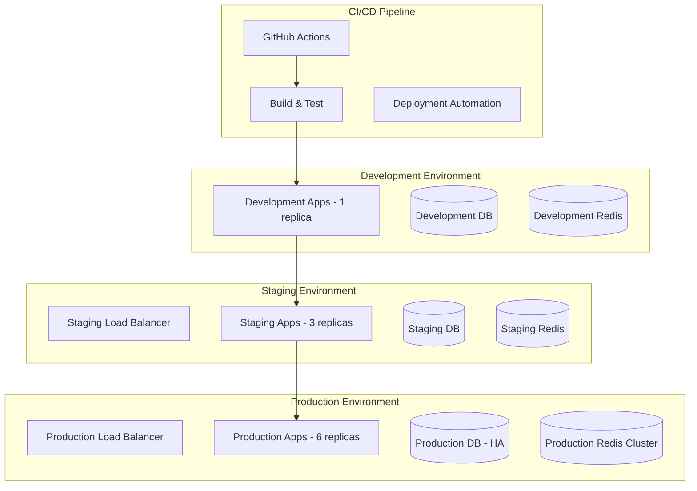

# Deployment Architecture - Production Guide

## Overview

This document provides comprehensive deployment architecture patterns and production setup guides for the Enhanced Plugin Management System. The architecture is designed for enterprise-scale deployments with high availability, security, and performance requirements.

## Multi-Environment Strategy

### Environment Topology



### Environment Configuration Matrix

| Environment | Replicas | CPU/Memory | Storage | Monitoring | Backup |
|-------------|----------|------------|---------|------------|--------|
| Development | 1 | 0.5 CPU / 1GB | 20GB | Basic | None |
| Staging | 3 | 1 CPU / 2GB | 100GB | Full | Daily |
| Production | 6-12 | 2 CPU / 4GB | 500GB+ | Enterprise | Continuous |

## Cloud Architecture Patterns

### AWS Architecture

```yaml
# AWS Infrastructure Components
VPC Configuration:
  - Multi-AZ deployment across 3 availability zones
  - Public/Private subnet architecture
  - NAT Gateways for outbound connectivity
  - VPC Endpoints for AWS services

Compute:
  - EKS Cluster: Managed Kubernetes service
  - EC2 Node Groups: Auto-scaling worker nodes
  - Fargate: Serverless container execution
  - Lambda: Event-driven functions

Storage:
  - RDS PostgreSQL: Multi-AZ with read replicas
  - ElastiCache: Redis cluster mode
  - EFS: Shared file system for persistent volumes
  - S3: Object storage for artifacts and backups

Networking:
  - Application Load Balancer: Layer 7 load balancing
  - CloudFront CDN: Global content delivery
  - Route 53: DNS management
  - AWS Certificate Manager: TLS certificates

Security:
  - IAM: Identity and access management
  - Secrets Manager: Secret rotation and management
  - KMS: Encryption key management
  - WAF: Web application firewall
```

### GCP Architecture

```yaml
# Google Cloud Platform Components
Project Structure:
  - Separate projects for dev/staging/production
  - Shared services project for monitoring
  - Network project for VPC peering

Compute:
  - GKE Autopilot: Fully managed Kubernetes
  - Cloud Run: Serverless container platform
  - Cloud Functions: Event-driven functions
  - Compute Engine: Custom VM instances

Storage:
  - Cloud SQL: Managed PostgreSQL with HA
  - Memorystore: Managed Redis service
  - Cloud Storage: Object storage buckets
  - Persistent Disks: Block storage for stateful workloads

Networking:
  - Cloud Load Balancing: Global load distribution
  - Cloud CDN: Content delivery network
  - Cloud DNS: Managed DNS service
  - Cloud Armor: DDoS protection and WAF

Security:
  - Cloud IAM: Identity and access management
  - Secret Manager: Centralized secret storage
  - Cloud KMS: Key management service
  - Binary Authorization: Container image security
```

### Azure Architecture

```yaml
# Microsoft Azure Components
Resource Groups:
  - Environment-based resource grouping
  - Shared services resource group
  - Monitoring and security resource group

Compute:
  - AKS: Azure Kubernetes Service
  - Container Instances: Serverless containers
  - Function Apps: Event-driven computing
  - Virtual Machines: Custom compute resources

Storage:
  - Azure Database for PostgreSQL: Managed database
  - Azure Cache for Redis: Managed cache service
  - Azure Storage: Blob, file, and queue storage
  - Azure Disk: Managed disk storage

Networking:
  - Application Gateway: Layer 7 load balancer
  - Azure CDN: Content delivery network
  - Azure DNS: Domain name system
  - Azure Firewall: Network security appliance

Security:
  - Azure Active Directory: Identity management
  - Azure Key Vault: Secret and key management
  - Azure Security Center: Unified security management
  - Azure Policy: Governance and compliance
```

## Kubernetes Cluster Architecture

### Cluster Configuration

```yaml
# Production Kubernetes Cluster Specification
apiVersion: v1
kind: ConfigMap
metadata:
  name: cluster-config
data:
  cluster.yaml: |
    # Master Node Configuration
    controlPlane:
      replicas: 3
      resources:
        cpu: 2
        memory: 4Gi
      etcdBackup:
        enabled: true
        schedule: "0 2 * * *"
    
    # Worker Node Configuration
    nodeGroups:
      - name: system
        minSize: 3
        maxSize: 6
        instanceType: m5.large
        labels:
          workload-type: system
      
      - name: application
        minSize: 6
        maxSize: 20
        instanceType: m5.xlarge
        labels:
          workload-type: application
      
      - name: memory-optimized
        minSize: 2
        maxSize: 10
        instanceType: r5.xlarge
        labels:
          workload-type: memory-intensive
    
    # Network Configuration
    networking:
      serviceSubnet: "10.100.0.0/16"
      podSubnet: "10.244.0.0/16"
      cni: "calico"
    
    # Security Configuration
    security:
      rbacEnabled: true
      podSecurityPolicyEnabled: true
      networkPolicyEnabled: true
```

### Service Mesh Integration

```yaml
# Istio Service Mesh Configuration
apiVersion: install.istio.io/v1alpha1
kind: IstioOperator
metadata:
  name: portal-service-mesh
spec:
  values:
    global:
      meshID: portal-mesh
      network: portal-network
      hub: gcr.io/istio-release
      tag: 1.20.0
    pilot:
      env:
        EXTERNAL_ISTIOD: false
    gateways:
      istio-ingressgateway:
        autoscaleEnabled: true
        autoscaleMin: 3
        autoscaleMax: 10
        resources:
          requests:
            cpu: 100m
            memory: 128Mi
          limits:
            cpu: 2000m
            memory: 1024Mi
  components:
    pilot:
      k8s:
        resources:
          requests:
            cpu: 200m
            memory: 512Mi
    ingressGateways:
    - name: istio-ingressgateway
      enabled: true
      k8s:
        service:
          type: LoadBalancer
        resources:
          requests:
            cpu: 100m
            memory: 128Mi
```

## Database Architecture

### PostgreSQL High Availability Setup

```yaml
# PostgreSQL Cluster Configuration
apiVersion: postgresql.cnpg.io/v1
kind: Cluster
metadata:
  name: postgres-cluster
  namespace: developer-portal
spec:
  instances: 3
  primaryUpdateStrategy: unsupervised
  
  postgresql:
    parameters:
      max_connections: "200"
      shared_preload_libraries: "pg_stat_statements"
      log_statement: "all"
      log_min_duration_statement: "1000"
      
  bootstrap:
    initdb:
      database: idp_portal
      owner: portal_user
      secret:
        name: postgres-credentials
        
  storage:
    size: 500Gi
    storageClass: fast-ssd
    
  resources:
    requests:
      memory: "4Gi"
      cpu: "2"
    limits:
      memory: "8Gi"
      cpu: "4"
      
  monitoring:
    enabled: true
    podMonitorSelector:
      matchLabels:
        cnpg.io/cluster: postgres-cluster
        
  backup:
    barmanObjectStore:
      destinationPath: "s3://backup-bucket/postgres"
      s3Credentials:
        accessKeyId:
          name: backup-credentials
          key: ACCESS_KEY_ID
        secretAccessKey:
          name: backup-credentials
          key: SECRET_ACCESS_KEY
      wal:
        retention: "7d"
      data:
        retention: "30d"
```

### Redis Cluster Configuration

```yaml
# Redis Cluster Setup
apiVersion: databases.spotahome.com/v1
kind: RedisFailover
metadata:
  name: redis-cluster
  namespace: developer-portal
spec:
  sentinel:
    replicas: 3
    resources:
      requests:
        cpu: 100m
        memory: 128Mi
      limits:
        cpu: 400m
        memory: 512Mi
        
  redis:
    replicas: 3
    resources:
      requests:
        cpu: 200m
        memory: 1Gi
      limits:
        cpu: 1
        memory: 4Gi
    storage:
      keepAfterDeletion: true
      size: 50Gi
      
  auth:
    secretPath: redis-auth
```

## CDN and Caching Strategy

### CloudFlare Configuration

```yaml
# CloudFlare Edge Rules
rules:
  - name: "Static Assets Cache"
    expression: '(http.request.uri.path matches "^/static/.*")'
    actions:
      - edge_cache_ttl: 31536000  # 1 year
      - browser_cache_ttl: 31536000
      
  - name: "API Response Cache"
    expression: '(http.request.uri.path matches "^/api/.*") and (http.request.method eq "GET")'
    actions:
      - edge_cache_ttl: 300  # 5 minutes
      - browser_cache_ttl: 60
      
  - name: "Dynamic Content"
    expression: '(http.request.uri.path matches "^/app/.*")'
    actions:
      - edge_cache_ttl: 0
      - browser_cache_ttl: 0

# Security Headers
security_headers:
  - name: "Content-Security-Policy"
    value: "default-src 'self'; script-src 'self' 'unsafe-inline'; style-src 'self' 'unsafe-inline';"
  - name: "X-Frame-Options"
    value: "DENY"
  - name: "X-Content-Type-Options"
    value: "nosniff"
  - name: "Strict-Transport-Security"
    value: "max-age=31536000; includeSubDomains"
```

## Monitoring Architecture

### Prometheus Stack Deployment

```yaml
# Prometheus Operator Configuration
apiVersion: monitoring.coreos.com/v1
kind: Prometheus
metadata:
  name: portal-prometheus
  namespace: monitoring
spec:
  serviceAccountName: prometheus
  serviceMonitorSelector:
    matchLabels:
      team: platform
  ruleSelector:
    matchLabels:
      team: platform
  resources:
    requests:
      memory: 2Gi
      cpu: 1
    limits:
      memory: 8Gi
      cpu: 4
  retention: 30d
  storage:
    volumeClaimTemplate:
      spec:
        storageClassName: fast-ssd
        resources:
          requests:
            storage: 200Gi
  alerting:
    alertmanagers:
    - namespace: monitoring
      name: alertmanager-main
      port: web

---
apiVersion: monitoring.coreos.com/v1
kind: ServiceMonitor
metadata:
  name: portal-frontend
  namespace: monitoring
  labels:
    team: platform
spec:
  selector:
    matchLabels:
      app: portal-frontend
  endpoints:
  - port: metrics
    interval: 30s
    path: /metrics
```

### Grafana Dashboard Configuration

```yaml
# Grafana Dashboard ConfigMap
apiVersion: v1
kind: ConfigMap
metadata:
  name: portal-dashboards
  namespace: monitoring
data:
  portal-overview.json: |
    {
      "dashboard": {
        "title": "Portal Overview",
        "panels": [
          {
            "title": "Request Rate",
            "type": "graph",
            "targets": [
              {
                "expr": "rate(http_requests_total{job=\"portal-frontend\"}[5m])"
              }
            ]
          },
          {
            "title": "Response Time",
            "type": "graph", 
            "targets": [
              {
                "expr": "histogram_quantile(0.95, rate(http_request_duration_seconds_bucket{job=\"portal-frontend\"}[5m]))"
              }
            ]
          },
          {
            "title": "Error Rate",
            "type": "stat",
            "targets": [
              {
                "expr": "rate(http_requests_total{job=\"portal-frontend\",status=~\"5..\"}[5m])"
              }
            ]
          }
        ]
      }
    }
```

## Security Configuration

### Network Security Policies

```yaml
# Network Policies for Zero Trust
apiVersion: networking.k8s.io/v1
kind: NetworkPolicy
metadata:
  name: portal-frontend-policy
  namespace: developer-portal
spec:
  podSelector:
    matchLabels:
      app: portal-frontend
  policyTypes:
  - Ingress
  - Egress
  ingress:
  - from:
    - namespaceSelector:
        matchLabels:
          name: istio-system
    ports:
    - protocol: TCP
      port: 4400
  egress:
  - to:
    - namespaceSelector:
        matchLabels:
          name: developer-portal
    - podSelector:
        matchLabels:
          app: backstage-backend
    ports:
    - protocol: TCP
      port: 7007
  - to:
    - namespaceSelector:
        matchLabels:
          name: developer-portal
    - podSelector:
        matchLabels:
          app: redis
    ports:
    - protocol: TCP
      port: 6379
```

### Pod Security Standards

```yaml
# Pod Security Policy
apiVersion: policy/v1beta1
kind: PodSecurityPolicy
metadata:
  name: portal-psp
spec:
  privileged: false
  allowPrivilegeEscalation: false
  requiredDropCapabilities:
    - ALL
  volumes:
    - 'configMap'
    - 'emptyDir'
    - 'projected'
    - 'secret'
    - 'downwardAPI'
    - 'persistentVolumeClaim'
  hostNetwork: false
  hostIPC: false
  hostPID: false
  runAsUser:
    rule: 'MustRunAsNonRoot'
  seLinux:
    rule: 'RunAsAny'
  fsGroup:
    rule: 'RunAsAny'
```

## Backup and Disaster Recovery

### Backup Strategy

```bash
#!/bin/bash
# Automated Backup Script

# Database Backup
pg_dump -h $DB_HOST -U $DB_USER -d $DB_NAME | \
gzip > /backups/postgres_$(date +%Y%m%d_%H%M%S).sql.gz

# Kubernetes Resources Backup
kubectl get all,configmaps,secrets,pvc -n developer-portal -o yaml | \
gzip > /backups/k8s_resources_$(date +%Y%m%d_%H%M%S).yaml.gz

# Upload to S3
aws s3 sync /backups/ s3://disaster-recovery-bucket/$(date +%Y/%m/%d)/

# Cleanup old backups (keep 30 days)
find /backups/ -name "*.gz" -mtime +30 -delete
```

### Disaster Recovery Procedures

```yaml
# DR Automation Configuration
apiVersion: v1
kind: ConfigMap
metadata:
  name: dr-procedures
data:
  recovery.sh: |
    #!/bin/bash
    # Disaster Recovery Automation
    
    # Step 1: Assess damage and determine recovery strategy
    echo "Assessing system status..."
    kubectl get nodes
    kubectl get pods --all-namespaces
    
    # Step 2: Restore database from backup
    echo "Restoring database..."
    LATEST_BACKUP=$(aws s3 ls s3://disaster-recovery-bucket/ --recursive | sort | tail -n 1 | awk '{print $4}')
    aws s3 cp s3://disaster-recovery-bucket/$LATEST_BACKUP /tmp/
    gunzip /tmp/postgres_*.sql.gz
    psql -h $DB_HOST -U $DB_USER -d $DB_NAME -f /tmp/postgres_*.sql
    
    # Step 3: Restore Kubernetes resources
    echo "Restoring Kubernetes resources..."
    kubectl apply -f /tmp/k8s_resources_*.yaml
    
    # Step 4: Verify system health
    echo "Verifying system health..."
    kubectl rollout status deployment/portal-frontend -n developer-portal
    kubectl rollout status deployment/backstage-backend -n developer-portal
    
    # Step 5: Run health checks
    curl -f http://portal.example.com/api/health
```

## Performance Optimization

### Auto-scaling Configuration

```yaml
# Horizontal Pod Autoscaler
apiVersion: autoscaling/v2
kind: HorizontalPodAutoscaler
metadata:
  name: portal-frontend-hpa
  namespace: developer-portal
spec:
  scaleTargetRef:
    apiVersion: apps/v1
    kind: Deployment
    name: portal-frontend
  minReplicas: 3
  maxReplicas: 20
  metrics:
  - type: Resource
    resource:
      name: cpu
      target:
        type: Utilization
        averageUtilization: 70
  - type: Resource
    resource:
      name: memory
      target:
        type: Utilization
        averageUtilization: 80
  behavior:
    scaleDown:
      stabilizationWindowSeconds: 300
      policies:
      - type: Percent
        value: 10
        periodSeconds: 60
    scaleUp:
      stabilizationWindowSeconds: 0
      policies:
      - type: Percent
        value: 100
        periodSeconds: 15
      - type: Pods
        value: 4
        periodSeconds: 15
      selectPolicy: Max
```

### Vertical Pod Autoscaler

```yaml
# Vertical Pod Autoscaler
apiVersion: autoscaling.k8s.io/v1
kind: VerticalPodAutoscaler
metadata:
  name: portal-backend-vpa
  namespace: developer-portal
spec:
  targetRef:
    apiVersion: apps/v1
    kind: Deployment
    name: backstage-backend
  updatePolicy:
    updateMode: "Auto"
  resourcePolicy:
    containerPolicies:
    - containerName: backstage
      minAllowed:
        cpu: 500m
        memory: 1Gi
      maxAllowed:
        cpu: 4
        memory: 8Gi
      controlledResources: ["cpu", "memory"]
```

## CI/CD Pipeline Configuration

### GitHub Actions Workflow

```yaml
name: Deploy to Production

on:
  push:
    branches: [main]
    tags: ['v*']

jobs:
  test:
    runs-on: ubuntu-latest
    steps:
      - uses: actions/checkout@v4
      - uses: actions/setup-node@v4
        with:
          node-version: '18'
          cache: 'npm'
      
      - name: Install dependencies
        run: npm ci
      
      - name: Run tests
        run: npm run test:all
      
      - name: Security scan
        uses: securecodewarrior/github-action-add-sarif@v1
        with:
          sarif-file: 'security-scan-results.sarif'

  build:
    needs: test
    runs-on: ubuntu-latest
    steps:
      - uses: actions/checkout@v4
      
      - name: Set up Docker Buildx
        uses: docker/setup-buildx-action@v3
      
      - name: Login to Container Registry
        uses: docker/login-action@v3
        with:
          registry: ${{ secrets.CONTAINER_REGISTRY }}
          username: ${{ secrets.REGISTRY_USERNAME }}
          password: ${{ secrets.REGISTRY_PASSWORD }}
      
      - name: Build and push
        uses: docker/build-push-action@v5
        with:
          context: .
          platforms: linux/amd64,linux/arm64
          push: true
          tags: |
            ${{ secrets.CONTAINER_REGISTRY }}/portal:${{ github.sha }}
            ${{ secrets.CONTAINER_REGISTRY }}/portal:latest
          cache-from: type=gha
          cache-to: type=gha,mode=max

  deploy:
    needs: build
    runs-on: ubuntu-latest
    environment: production
    steps:
      - uses: actions/checkout@v4
      
      - name: Setup Kubectl
        uses: azure/setup-kubectl@v3
        with:
          version: 'v1.28.0'
      
      - name: Set up Helm
        uses: azure/setup-helm@v3
        with:
          version: '3.12.0'
      
      - name: Deploy to Kubernetes
        run: |
          helm upgrade --install portal-frontend ./helm/portal \
            --namespace developer-portal \
            --set image.tag=${{ github.sha }} \
            --set environment=production \
            --wait --timeout=10m
```

This deployment architecture provides enterprise-grade scalability, security, and reliability for the enhanced plugin management system. The configuration supports multi-cloud deployment with comprehensive monitoring, backup, and disaster recovery capabilities.