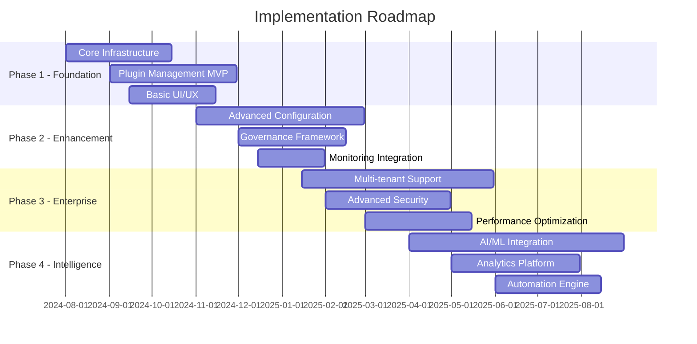

# Implementation Roadmap - Enhanced Plugin Management System

## Executive Summary

This roadmap outlines a phased approach to implementing the enhanced plugin management system over 18 months, with each phase delivering incremental value while building towards a comprehensive enterprise platform.

## Overall Timeline and Milestones



## Phase 1: Foundation and MVP (Months 1-4)

### Objectives
- Establish core infrastructure and development practices
- Deliver a minimum viable plugin management system
- Build foundational monitoring and security frameworks

### Phase 1.1: Infrastructure Setup (Month 1-2)

#### Week 1-2: Development Environment
```bash
# Infrastructure Setup Tasks
1. Kubernetes cluster setup (EKS/GKE/AKS)
2. CI/CD pipeline configuration (GitHub Actions)
3. Container registry setup
4. Development environment provisioning
5. Basic monitoring stack (Prometheus/Grafana)
```

#### Week 3-4: Core Services
```yaml
Services to Deploy:
  - PostgreSQL cluster with high availability
  - Redis cluster for caching and sessions
  - HashiCorp Vault for secret management
  - Basic Istio service mesh configuration
  - SSL/TLS certificate management
```

#### Week 5-6: Security Foundation
- Authentication service setup (OAuth2/SAML)
- Basic RBAC implementation
- Network policies and security groups
- Vulnerability scanning pipeline
- Security audit logging

#### Week 7-8: Development Practices
- Code quality gates (ESLint, Prettier, SonarQube)
- Automated testing pipeline
- Documentation framework
- Git workflow and branch protection
- Container security scanning

### Phase 1.2: Plugin Management MVP (Month 2-3)

#### Core Plugin Registry
```typescript
// MVP Plugin Registry Features
interface PluginRegistryMVP {
  // Basic CRUD operations
  createPlugin(plugin: PluginMetadata): Promise<Plugin>;
  updatePlugin(id: string, updates: PluginUpdate): Promise<Plugin>;
  deletePlugin(id: string): Promise<void>;
  getPlugin(id: string): Promise<Plugin>;
  listPlugins(query: PluginQuery): Promise<PluginList>;
  
  // Installation management
  installPlugin(pluginId: string, config: InstallConfig): Promise<Installation>;
  uninstallPlugin(installationId: string): Promise<void>;
  
  // Basic dependency resolution
  validateDependencies(plugin: Plugin): Promise<ValidationResult>;
}
```

#### Plugin Lifecycle Management
- Plugin upload and validation
- Semantic versioning support
- Basic dependency checking
- Installation status tracking
- Error handling and rollback

#### Simple Web Interface
- Plugin browsing and search
- Installation/uninstallation UI
- Basic plugin configuration forms
- System health dashboard
- User authentication

### Phase 1.3: Basic Monitoring and Alerting (Month 3-4)

#### Observability Stack
```yaml
# Monitoring Configuration
prometheus:
  retention: 30d
  scrape_configs:
    - job_name: 'portal-frontend'
      metrics_path: '/metrics'
    - job_name: 'plugin-registry'
      metrics_path: '/health'

grafana:
  dashboards:
    - System Overview
    - Plugin Installation Metrics
    - User Activity Dashboard
    - Performance Metrics

alertmanager:
  rules:
    - System Down Alerts
    - High Error Rate Alerts
    - Plugin Installation Failures
```

#### Health Checks and SLA Monitoring
- Service availability monitoring
- Response time tracking
- Error rate alerting
- Capacity planning metrics

### Phase 1 Deliverables
- ✅ Production-ready Kubernetes infrastructure
- ✅ Basic plugin management system with core CRUD operations
- ✅ Simple web interface for plugin management
- ✅ Basic monitoring and alerting
- ✅ Security foundation with authentication and RBAC
- ✅ CI/CD pipeline with automated testing

### Phase 1 Success Metrics
- System uptime: 99.5%
- Plugin installation time: <2 minutes
- API response time: <500ms
- Zero security incidents
- 100% test coverage for core functionality

## Phase 2: Advanced Configuration and Governance (Months 5-8)

### Objectives
- Implement advanced plugin configuration management
- Establish governance and compliance frameworks
- Enhance monitoring and observability
- Add workflow automation capabilities

### Phase 2.1: Advanced Plugin Configuration (Month 5-6)

#### Dynamic Configuration Management
```typescript
interface AdvancedConfiguration {
  // Environment-specific configurations
  environmentConfigs: Map<Environment, PluginConfig>;
  
  // Feature flags and rollout controls
  featureFlags: FeatureFlagConfig;
  
  // A/B testing capabilities
  experiments: ExperimentConfig[];
  
  // Configuration validation and schema
  configSchema: JSONSchema;
  
  // Configuration history and rollback
  configHistory: ConfigurationHistory;
}
```

#### Configuration Features
- Environment-specific configuration management
- Configuration templates and inheritance
- Real-time configuration updates
- Configuration validation and testing
- Rollback and audit capabilities

#### Plugin Marketplace Enhancement
- Advanced search and filtering
- Plugin categories and tagging
- User ratings and reviews
- Plugin recommendations engine
- Community contributions workflow

### Phase 2.2: Governance Framework (Month 6-7)

#### Plugin Governance System
```yaml
# Governance Policies
plugin_governance:
  approval_workflow:
    - security_review: required
    - architecture_review: required_for_critical
    - business_approval: required_for_enterprise
  
  compliance_checks:
    - license_compatibility: enforced
    - security_scanning: required
    - performance_benchmarks: advisory
    - documentation_standards: required
  
  lifecycle_management:
    - deprecation_policy: 90_day_notice
    - end_of_life_support: 180_day_timeline
    - migration_assistance: provided
```

#### Compliance and Audit
- Plugin approval workflows
- Compliance scanning and reporting
- License management and tracking
- Audit trail and reporting
- Risk assessment framework

#### Policy as Code
- Policy definition using Open Policy Agent (OPA)
- Automated policy enforcement
- Policy testing and validation
- Policy documentation and versioning

### Phase 2.3: Enhanced Monitoring (Month 7-8)

#### Advanced Observability
```typescript
interface EnhancedMonitoring {
  // Distributed tracing
  tracing: JaegerTracing;
  
  // Business metrics
  businessMetrics: {
    pluginAdoptionRates: Metric[];
    userSatisfactionScores: Metric[];
    timeToProductivity: Metric[];
  };
  
  // Performance analytics
  performanceMetrics: {
    pluginPerformanceScores: PerformanceMetric[];
    systemResourceUtilization: ResourceMetric[];
    userExperienceMetrics: UXMetric[];
  };
  
  // Security monitoring
  securityMetrics: {
    threatDetection: SecurityEvent[];
    vulnerabilityScans: VulnerabilityReport[];
    accessAnomalies: AnomalyDetection[];
  };
}
```

#### Advanced Dashboards
- Business intelligence dashboards
- Plugin performance analytics
- User behavior analysis
- Cost optimization insights
- Predictive maintenance alerts

### Phase 2 Deliverables
- ✅ Advanced plugin configuration management system
- ✅ Comprehensive governance and compliance framework
- ✅ Enhanced monitoring and observability platform
- ✅ Plugin marketplace with advanced features
- ✅ Workflow automation for plugin lifecycle

### Phase 2 Success Metrics
- Configuration deployment time: <10 minutes
- Governance compliance rate: 95%
- Mean time to detection (MTTD): <5 minutes
- Plugin approval cycle time: <2 days
- User satisfaction score: >4.2/5

## Phase 3: Enterprise Features and Scaling (Months 9-12)

### Objectives
- Implement enterprise-grade multi-tenancy
- Advanced security and compliance features
- Performance optimization and scaling
- High availability and disaster recovery

### Phase 3.1: Multi-Tenant Architecture (Month 9-10)

#### Tenant Isolation
```typescript
interface MultiTenantArchitecture {
  // Tenant management
  tenants: TenantManager;
  
  // Resource isolation
  resourceIsolation: {
    compute: ComputeIsolation;
    storage: StorageIsolation;
    network: NetworkIsolation;
  };
  
  // Tenant-specific configurations
  tenantConfigs: Map<TenantId, TenantConfiguration>;
  
  // Cross-tenant integrations
  federatedServices: FederatedServiceConfig[];
}
```

#### Enterprise Features
- Tenant onboarding automation
- Resource quotas and billing
- Cross-tenant plugin sharing
- Federated authentication
- Tenant-specific customization

### Phase 3.2: Advanced Security (Month 10-11)

#### Zero Trust Implementation
- Identity-based security policies
- Continuous security monitoring
- Behavioral analytics
- Threat hunting capabilities
- Incident response automation

#### Compliance Frameworks
- SOC 2 Type II compliance
- GDPR data protection compliance
- ISO 27001 security management
- NIST cybersecurity framework
- Industry-specific compliance (HIPAA, PCI DSS)

### Phase 3.3: Performance Optimization (Month 11-12)

#### Scaling Architecture
```yaml
# Auto-scaling Configuration
horizontal_pod_autoscaler:
  metrics:
    - type: Resource
      resource: cpu
      target: 70%
    - type: Resource
      resource: memory
      target: 80%
    - type: Custom
      custom:
        metric: plugin_installations_per_second
        target: 100

vertical_pod_autoscaler:
  update_policy: Auto
  resource_policy:
    min_allowed:
      cpu: 100m
      memory: 128Mi
    max_allowed:
      cpu: 4
      memory: 8Gi
```

#### Performance Features
- Intelligent caching strategies
- Database query optimization
- CDN integration and optimization
- Load balancing optimization
- Resource usage optimization

### Phase 3 Deliverables
- ✅ Enterprise multi-tenant architecture
- ✅ Advanced security and compliance features
- ✅ Performance optimization and auto-scaling
- ✅ High availability and disaster recovery
- ✅ Advanced analytics and reporting

### Phase 3 Success Metrics
- System availability: 99.9%
- Multi-tenant isolation: 100% verified
- Performance improvement: 3x baseline
- Security incidents: Zero tolerance
- Disaster recovery time: <15 minutes

## Phase 4: AI/ML Integration and Optimization (Months 13-18)

### Objectives
- Implement AI-powered plugin recommendations
- Advanced analytics and insights
- Intelligent automation and optimization
- Predictive maintenance and scaling

### Phase 4.1: AI/ML Platform (Month 13-15)

#### Machine Learning Pipeline
```typescript
interface MLPlatform {
  // Data pipeline
  dataIngestion: DataIngestionService;
  featureEngineering: FeatureEngineeringPipeline;
  
  // Model training and deployment
  modelTraining: MLTrainingPipeline;
  modelServing: MLServingPlatform;
  
  // AI services
  recommendationEngine: PluginRecommendationService;
  anomalyDetection: AnomalyDetectionService;
  predictiveAnalytics: PredictiveAnalyticsService;
}
```

#### AI Features
- Intelligent plugin recommendations
- Usage pattern analysis
- Anomaly detection and alerting
- Predictive capacity planning
- Automated optimization suggestions

### Phase 4.2: Advanced Analytics (Month 15-16)

#### Business Intelligence Platform
- Real-time analytics dashboards
- Custom report generation
- Data export and integration
- Advanced visualization tools
- Self-service analytics

#### Insights and Intelligence
- Plugin adoption trends
- User behavior patterns
- Performance optimization opportunities
- Cost optimization recommendations
- Security risk assessments

### Phase 4.3: Automation Engine (Month 16-18)

#### Intelligent Automation
```yaml
# Automation Rules Engine
automation_rules:
  - name: "Auto-scale on high load"
    trigger:
      metric: cpu_utilization
      threshold: 80%
      duration: 5m
    action:
      type: scale_up
      factor: 1.5
      max_replicas: 20
  
  - name: "Plugin health check"
    trigger:
      schedule: "0 */6 * * *"
    action:
      type: health_check
      remediation: auto_restart
      notification: alert_team
```

#### Self-Healing Systems
- Automated problem detection and resolution
- Self-optimizing resource allocation
- Proactive maintenance scheduling
- Intelligent load balancing
- Automated security responses

### Phase 4 Deliverables
- ✅ AI/ML platform with recommendation engine
- ✅ Advanced analytics and business intelligence
- ✅ Intelligent automation and self-healing systems
- ✅ Predictive maintenance and optimization
- ✅ Advanced user experience features

### Phase 4 Success Metrics
- Recommendation accuracy: >85%
- Automated issue resolution: 70%
- Predictive maintenance accuracy: >90%
- User productivity improvement: 40%
- System efficiency improvement: 50%

## Risk Assessment and Mitigation

### High-Risk Items

#### Technical Risks
1. **Integration Complexity**
   - Risk: Complex integrations with existing systems
   - Mitigation: Proof of concepts, gradual rollout
   - Contingency: Fallback to simpler integration patterns

2. **Performance at Scale**
   - Risk: System performance degradation under load
   - Mitigation: Load testing, performance monitoring
   - Contingency: Horizontal scaling, caching strategies

3. **Security Vulnerabilities**
   - Risk: Security breaches or vulnerabilities
   - Mitigation: Security reviews, penetration testing
   - Contingency: Security incident response plan

#### Organizational Risks
1. **Resource Availability**
   - Risk: Key team members unavailable
   - Mitigation: Cross-training, documentation
   - Contingency: External contractor support

2. **Scope Creep**
   - Risk: Uncontrolled feature additions
   - Mitigation: Change control process
   - Contingency: Feature prioritization framework

### Risk Monitoring
- Weekly risk assessment reviews
- Automated risk indicator monitoring
- Escalation procedures for high-risk situations
- Regular stakeholder communication

## Resource Allocation

### Team Structure
```yaml
Core Team:
  - Technical Lead: 1 FTE
  - Senior Engineers: 3 FTE
  - DevOps Engineers: 2 FTE
  - QA Engineers: 2 FTE
  - UX/UI Designer: 1 FTE
  - Product Manager: 1 FTE

Support Team:
  - Security Architect: 0.5 FTE
  - Data Engineer: 1 FTE (Phase 4)
  - ML Engineer: 1 FTE (Phase 4)
  - Technical Writer: 0.5 FTE
```

### Budget Allocation
- Personnel: 70%
- Infrastructure: 20%
- Tools and Licenses: 5%
- Training and Development: 3%
- Contingency: 2%

## Success Criteria and KPIs

### Phase-Specific KPIs
Each phase includes specific success metrics as outlined above.

### Overall Program KPIs
- **System Availability**: 99.9% uptime across all phases
- **User Adoption**: 80% of developers using the platform
- **Time to Value**: Reduce plugin integration time by 60%
- **Developer Satisfaction**: >4.5/5 satisfaction score
- **Cost Efficiency**: 30% reduction in plugin management overhead
- **Security Posture**: Zero critical security incidents

### Measurement and Reporting
- Monthly progress reports
- Quarterly stakeholder reviews
- Real-time dashboard monitoring
- Post-implementation reviews
- Continuous improvement processes

This roadmap provides a comprehensive plan for implementing the enhanced plugin management system while ensuring each phase delivers tangible value and builds toward a robust, enterprise-ready platform.