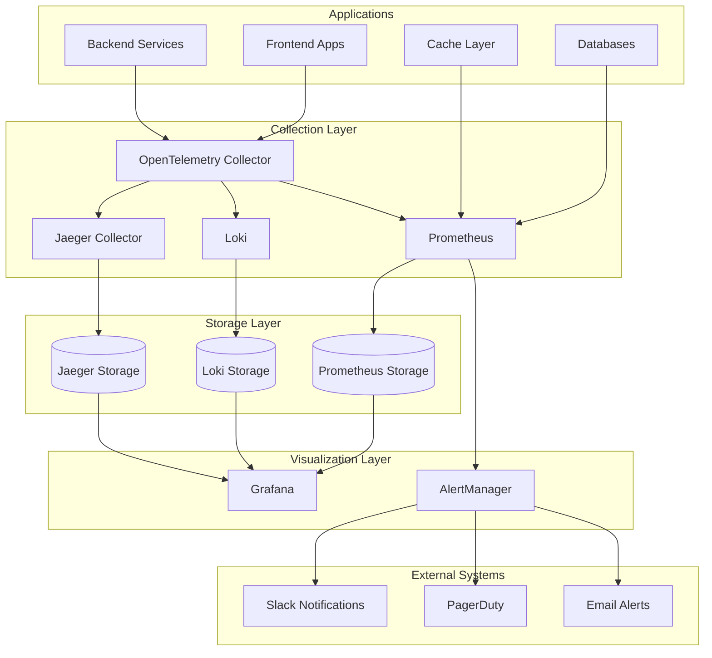

# Monitoring and Observability Architecture

## Overview

This document outlines the comprehensive monitoring and observability architecture for the Enhanced Plugin Management System. The architecture provides full-stack visibility into system performance, user behavior, business metrics, and operational health through a modern observability stack.

## Observability Strategy

### Three Pillars of Observability

#### 1. Metrics (Prometheus + Grafana)
- **Application Metrics**: Request rates, error rates, response times
- **Infrastructure Metrics**: CPU, memory, disk, network utilization
- **Business Metrics**: Plugin installations, user activity, system adoption
- **Custom Metrics**: Plugin-specific performance indicators

#### 2. Logs (Loki + Grafana)
- **Structured Logging**: JSON formatted logs with consistent schema
- **Centralized Collection**: Aggregated logs from all services
- **Log Correlation**: Trace ID linking for distributed troubleshooting
- **Real-time Streaming**: Live log tailing and alerting

#### 3. Traces (Jaeger + OpenTelemetry)
- **Distributed Tracing**: End-to-end request flow visualization
- **Performance Analysis**: Bottleneck identification and optimization
- **Dependency Mapping**: Service interaction patterns
- **Error Attribution**: Root cause analysis for failures

## Architecture Components

### Monitoring Stack Overview



### Prometheus Configuration

#### Core Metrics Collection
```yaml
# prometheus.yaml
global:
  scrape_interval: 15s
  evaluation_interval: 15s
  external_labels:
    cluster: 'portal-production'
    environment: 'production'

rule_files:
  - "rules/*.yml"

alerting:
  alertmanagers:
    - static_configs:
        - targets:
          - alertmanager:9093

scrape_configs:
  # Application metrics
  - job_name: 'portal-frontend'
    static_configs:
      - targets: ['portal-frontend:9090']
    scrape_interval: 30s
    metrics_path: '/metrics'
    scheme: http
  
  - job_name: 'backstage-backend'
    static_configs:
      - targets: ['backstage-backend:9090']
    scrape_interval: 30s
    metrics_path: '/metrics'
    scheme: http
  
  # Infrastructure metrics
  - job_name: 'node-exporter'
    static_configs:
      - targets: ['node-exporter:9100']
    scrape_interval: 30s
  
  - job_name: 'postgres-exporter'
    static_configs:
      - targets: ['postgres-exporter:9187']
    scrape_interval: 30s
  
  - job_name: 'redis-exporter'
    static_configs:
      - targets: ['redis-exporter:9121']
    scrape_interval: 30s
  
  # Kubernetes metrics
  - job_name: 'kubernetes-apiservers'
    kubernetes_sd_configs:
      - role: endpoints
    scheme: https
    tls_config:
      ca_file: /var/run/secrets/kubernetes.io/serviceaccount/ca.crt
    bearer_token_file: /var/run/secrets/kubernetes.io/serviceaccount/token
    relabel_configs:
      - source_labels: [__meta_kubernetes_namespace, __meta_kubernetes_service_name, __meta_kubernetes_endpoint_port_name]
        action: keep
        regex: default;kubernetes;https
  
  - job_name: 'kubernetes-pods'
    kubernetes_sd_configs:
      - role: pod
    relabel_configs:
      - source_labels: [__meta_kubernetes_pod_annotation_prometheus_io_scrape]
        action: keep
        regex: true
      - source_labels: [__meta_kubernetes_pod_annotation_prometheus_io_path]
        action: replace
        target_label: __metrics_path__
        regex: (.+)
      - source_labels: [__address__, __meta_kubernetes_pod_annotation_prometheus_io_port]
        action: replace
        regex: ([^:]+)(?::\d+)?;(\d+)
        replacement: $1:$2
        target_label: __address__
      - action: labelmap
        regex: __meta_kubernetes_pod_label_(.+)
```

#### Custom Metrics Definition
```typescript
// Application metrics instrumentation
import { register, Counter, Histogram, Gauge } from 'prom-client';

// HTTP request metrics
export const httpRequestDuration = new Histogram({
  name: 'http_request_duration_seconds',
  help: 'Duration of HTTP requests in seconds',
  labelNames: ['method', 'route', 'status_code', 'user_id'],
  buckets: [0.1, 0.3, 0.5, 0.7, 1, 3, 5, 7, 10]
});

// Plugin-specific metrics
export const pluginInstallations = new Counter({
  name: 'plugin_installations_total',
  help: 'Total number of plugin installations',
  labelNames: ['plugin_id', 'version', 'organization', 'status']
});

export const activePlugins = new Gauge({
  name: 'active_plugins_count',
  help: 'Number of currently active plugins',
  labelNames: ['organization', 'environment']
});

// Business metrics
export const userActivity = new Counter({
  name: 'user_activity_total',
  help: 'Total user activity events',
  labelNames: ['action', 'user_role', 'organization']
});

export const systemHealth = new Gauge({
  name: 'system_health_score',
  help: 'Overall system health score (0-1)',
  labelNames: ['service', 'environment']
});

// Database metrics
export const databaseConnections = new Gauge({
  name: 'database_connections_active',
  help: 'Number of active database connections',
  labelNames: ['database', 'state']
});

export const queryDuration = new Histogram({
  name: 'database_query_duration_seconds',
  help: 'Duration of database queries',
  labelNames: ['operation', 'table'],
  buckets: [0.01, 0.05, 0.1, 0.25, 0.5, 1, 2.5, 5, 10]
});

// Register all metrics
register.registerMetric(httpRequestDuration);
register.registerMetric(pluginInstallations);
register.registerMetric(activePlugins);
register.registerMetric(userActivity);
register.registerMetric(systemHealth);
register.registerMetric(databaseConnections);
register.registerMetric(queryDuration);
```

### Alerting Rules

#### Critical System Alerts
```yaml
# alerts/system.yml
groups:
  - name: system.rules
    rules:
      - alert: ServiceDown
        expr: up{job=~"portal-.*"} == 0
        for: 1m
        labels:
          severity: critical
          team: platform
        annotations:
          summary: "Service {{ $labels.job }} is down"
          description: "{{ $labels.job }} has been down for more than 1 minute"
          runbook_url: "https://docs.portal.company.com/runbooks/service-down"
      
      - alert: HighErrorRate
        expr: rate(http_requests_total{status=~"5.."}[5m]) / rate(http_requests_total[5m]) > 0.05
        for: 2m
        labels:
          severity: warning
          team: platform
        annotations:
          summary: "High error rate detected"
          description: "Error rate is {{ $value | humanizePercentage }} for {{ $labels.job }}"
          runbook_url: "https://docs.portal.company.com/runbooks/high-error-rate"
      
      - alert: HighLatency
        expr: histogram_quantile(0.95, rate(http_request_duration_seconds_bucket[5m])) > 2
        for: 5m
        labels:
          severity: warning
          team: platform
        annotations:
          summary: "High latency detected"
          description: "95th percentile latency is {{ $value }}s for {{ $labels.job }}"
          runbook_url: "https://docs.portal.company.com/runbooks/high-latency"
      
      - alert: DatabaseConnectionHigh
        expr: database_connections_active > 80
        for: 5m
        labels:
          severity: warning
          team: platform
        annotations:
          summary: "High database connection count"
          description: "Database has {{ $value }} active connections"
          runbook_url: "https://docs.portal.company.com/runbooks/database-connections"
      
      - alert: DiskSpaceRunningOut
        expr: (node_filesystem_avail_bytes{mountpoint="/"} / node_filesystem_size_bytes{mountpoint="/"}) < 0.1
        for: 5m
        labels:
          severity: critical
          team: platform
        annotations:
          summary: "Disk space running out"
          description: "Disk space is {{ $value | humanizePercentage }} full on {{ $labels.instance }}"
          runbook_url: "https://docs.portal.company.com/runbooks/disk-space"
```

#### Business Logic Alerts
```yaml
# alerts/business.yml
groups:
  - name: business.rules
    rules:
      - alert: PluginInstallationFailureSpike
        expr: increase(plugin_installations_total{status="failed"}[10m]) > 10
        for: 2m
        labels:
          severity: warning
          team: product
        annotations:
          summary: "Plugin installation failure spike"
          description: "{{ $value }} plugin installations have failed in the last 10 minutes"
          runbook_url: "https://docs.portal.company.com/runbooks/plugin-failures"
      
      - alert: LowUserActivity
        expr: rate(user_activity_total[1h]) < 10
        for: 30m
        labels:
          severity: warning
          team: product
        annotations:
          summary: "Low user activity detected"
          description: "User activity rate is {{ $value }} events per second"
          runbook_url: "https://docs.portal.company.com/runbooks/user-activity"
      
      - alert: SystemHealthDegraded
        expr: system_health_score < 0.8
        for: 5m
        labels:
          severity: warning
          team: platform
        annotations:
          summary: "System health degraded"
          description: "System health score is {{ $value }} for {{ $labels.service }}"
          runbook_url: "https://docs.portal.company.com/runbooks/system-health"
```

### Grafana Dashboards

#### System Overview Dashboard
```json
{
  "dashboard": {
    "id": null,
    "title": "Portal System Overview",
    "tags": ["portal", "overview"],
    "timezone": "browser",
    "panels": [
      {
        "id": 1,
        "title": "Request Rate",
        "type": "graph",
        "gridPos": {"h": 8, "w": 12, "x": 0, "y": 0},
        "targets": [
          {
            "expr": "sum(rate(http_requests_total[5m])) by (service)",
            "legendFormat": "{{service}}"
          }
        ],
        "yAxes": [
          {
            "label": "Requests/sec",
            "min": 0
          }
        ]
      },
      {
        "id": 2,
        "title": "Error Rate",
        "type": "graph",
        "gridPos": {"h": 8, "w": 12, "x": 12, "y": 0},
        "targets": [
          {
            "expr": "sum(rate(http_requests_total{status=~\"5..\"}[5m])) by (service) / sum(rate(http_requests_total[5m])) by (service)",
            "legendFormat": "{{service}}"
          }
        ],
        "yAxes": [
          {
            "label": "Error Rate",
            "min": 0,
            "max": 1,
            "unit": "percentunit"
          }
        ]
      },
      {
        "id": 3,
        "title": "Response Time (95th percentile)",
        "type": "graph",
        "gridPos": {"h": 8, "w": 24, "x": 0, "y": 8},
        "targets": [
          {
            "expr": "histogram_quantile(0.95, sum(rate(http_request_duration_seconds_bucket[5m])) by (le, service))",
            "legendFormat": "{{service}}"
          }
        ],
        "yAxes": [
          {
            "label": "Response Time",
            "min": 0,
            "unit": "s"
          }
        ]
      },
      {
        "id": 4,
        "title": "Active Users",
        "type": "stat",
        "gridPos": {"h": 4, "w": 6, "x": 0, "y": 16},
        "targets": [
          {
            "expr": "count(count by (user_id) (rate(user_activity_total[5m]) > 0))"
          }
        ],
        "fieldConfig": {
          "defaults": {
            "color": {"mode": "thresholds"},
            "thresholds": {
              "steps": [
                {"color": "red", "value": 0},
                {"color": "yellow", "value": 10},
                {"color": "green", "value": 50}
              ]
            }
          }
        }
      },
      {
        "id": 5,
        "title": "Plugin Installations (24h)",
        "type": "stat",
        "gridPos": {"h": 4, "w": 6, "x": 6, "y": 16},
        "targets": [
          {
            "expr": "increase(plugin_installations_total{status=\"success\"}[24h])"
          }
        ]
      },
      {
        "id": 6,
        "title": "System Health Score",
        "type": "gauge",
        "gridPos": {"h": 8, "w": 12, "x": 12, "y": 16},
        "targets": [
          {
            "expr": "avg(system_health_score)"
          }
        ],
        "fieldConfig": {
          "defaults": {
            "min": 0,
            "max": 1,
            "color": {"mode": "thresholds"},
            "thresholds": {
              "steps": [
                {"color": "red", "value": 0},
                {"color": "yellow", "value": 0.7},
                {"color": "green", "value": 0.9}
              ]
            }
          }
        }
      }
    ],
    "time": {
      "from": "now-1h",
      "to": "now"
    },
    "refresh": "5s"
  }
}
```

#### Plugin Performance Dashboard
```json
{
  "dashboard": {
    "title": "Plugin Performance Analytics",
    "panels": [
      {
        "title": "Plugin Installation Success Rate",
        "type": "graph",
        "targets": [
          {
            "expr": "sum(rate(plugin_installations_total{status=\"success\"}[5m])) by (plugin_id) / sum(rate(plugin_installations_total[5m])) by (plugin_id)"
          }
        ]
      },
      {
        "title": "Top Installed Plugins",
        "type": "table",
        "targets": [
          {
            "expr": "topk(10, sum(plugin_installations_total{status=\"success\"}) by (plugin_id))"
          }
        ]
      },
      {
        "title": "Plugin Error Rate by Version",
        "type": "heatmap",
        "targets": [
          {
            "expr": "sum(rate(plugin_installations_total{status=\"failed\"}[5m])) by (plugin_id, version)"
          }
        ]
      },
      {
        "title": "Active Plugin Count by Organization",
        "type": "piechart",
        "targets": [
          {
            "expr": "sum(active_plugins_count) by (organization)"
          }
        ]
      }
    ]
  }
}
```

### Distributed Tracing with Jaeger

#### OpenTelemetry Configuration
```typescript
// tracing.ts
import { NodeSDK } from '@opentelemetry/sdk-node';
import { Resource } from '@opentelemetry/resources';
import { SemanticResourceAttributes } from '@opentelemetry/semantic-conventions';
import { JaegerExporter } from '@opentelemetry/exporter-jaeger';
import { getNodeAutoInstrumentations } from '@opentelemetry/auto-instrumentations-node';

// Initialize the SDK
const sdk = new NodeSDK({
  resource: new Resource({
    [SemanticResourceAttributes.SERVICE_NAME]: 'portal-backend',
    [SemanticResourceAttributes.SERVICE_VERSION]: '1.0.0',
    [SemanticResourceAttributes.DEPLOYMENT_ENVIRONMENT]: process.env.NODE_ENV || 'development'
  }),
  traceExporter: new JaegerExporter({
    endpoint: process.env.JAEGER_ENDPOINT || 'http://jaeger:14268/api/traces'
  }),
  instrumentations: [
    getNodeAutoInstrumentations({
      '@opentelemetry/instrumentation-fs': {
        enabled: false // Disable file system instrumentation for performance
      }
    })
  ]
});

// Start the SDK
sdk.start();

// Custom tracing for business logic
import { trace, SpanStatusCode } from '@opentelemetry/api';

const tracer = trace.getTracer('plugin-service');

export async function installPlugin(pluginId: string, config: InstallConfig): Promise<Plugin> {
  return tracer.startActiveSpan('plugin.install', async (span) => {
    try {
      span.setAttributes({
        'plugin.id': pluginId,
        'plugin.version': config.version,
        'user.organization': config.organizationId
      });
      
      // Validate plugin
      await tracer.startActiveSpan('plugin.validate', async (validateSpan) => {
        const validationResult = await validatePlugin(pluginId);
        validateSpan.setAttributes({
          'validation.result': validationResult.valid,
          'validation.errors': validationResult.errors.length
        });
        validateSpan.end();
      });
      
      // Install plugin
      const plugin = await tracer.startActiveSpan('plugin.install.execute', async (installSpan) => {
        const result = await executeInstallation(pluginId, config);
        installSpan.setAttributes({
          'installation.duration': Date.now() - installSpan.startTime,
          'installation.success': true
        });
        installSpan.end();
        return result;
      });
      
      span.setStatus({ code: SpanStatusCode.OK });
      return plugin;
      
    } catch (error) {
      span.recordException(error);
      span.setStatus({
        code: SpanStatusCode.ERROR,
        message: error.message
      });
      throw error;
    } finally {
      span.end();
    }
  });
}
```

### Log Aggregation with Loki

#### Structured Logging Configuration
```typescript
// logging.ts
import winston from 'winston';
import LokiTransport from 'winston-loki';

// Create logger with structured format
const logger = winston.createLogger({
  level: process.env.LOG_LEVEL || 'info',
  format: winston.format.combine(
    winston.format.timestamp(),
    winston.format.errors({ stack: true }),
    winston.format.json(),
    winston.format.printf(({ timestamp, level, message, service, traceId, spanId, ...meta }) => {
      return JSON.stringify({
        timestamp,
        level,
        message,
        service: service || 'portal-backend',
        traceId,
        spanId,
        ...meta
      });
    })
  ),
  defaultMeta: {
    service: 'portal-backend',
    version: '1.0.0',
    environment: process.env.NODE_ENV || 'development'
  },
  transports: [
    new winston.transports.Console(),
    new LokiTransport({
      host: process.env.LOKI_HOST || 'http://loki:3100',
      labels: {
        app: 'portal-backend',
        environment: process.env.NODE_ENV || 'development'
      },
      json: true,
      format: winston.format.json(),
      replaceTimestamp: true,
      onConnectionError: (err) => console.error('Loki connection error:', err)
    })
  ]
});

// Enhanced logging with trace correlation
export function createContextLogger(traceId?: string, spanId?: string) {
  return logger.child({ traceId, spanId });
}

// Usage example
export function logPluginInstallation(pluginId: string, result: InstallResult, traceId?: string) {
  const contextLogger = createContextLogger(traceId);
  
  contextLogger.info('Plugin installation completed', {
    event: 'plugin_installation',
    plugin_id: pluginId,
    success: result.success,
    duration: result.duration,
    error: result.error?.message,
    metadata: {
      version: result.version,
      organization: result.organizationId,
      user: result.userId
    }
  });
}
```

### Health Monitoring

#### Comprehensive Health Check System
```typescript
// health.ts
import { Request, Response } from 'express';
import { systemHealthScore } from './metrics';

interface HealthCheck {
  name: string;
  check: () => Promise<HealthResult>;
  critical: boolean;
}

interface HealthResult {
  healthy: boolean;
  message: string;
  responseTime: number;
  metadata?: Record<string, unknown>;
}

class HealthMonitor {
  private checks: HealthCheck[] = [];
  
  public addCheck(check: HealthCheck): void {
    this.checks.push(check);
  }
  
  public async runHealthChecks(): Promise<{
    healthy: boolean;
    checks: Record<string, HealthResult>;
    score: number;
  }> {
    const results: Record<string, HealthResult> = {};
    let healthyCount = 0;
    let criticalFailures = 0;
    
    for (const check of this.checks) {
      try {
        const result = await check.check();
        results[check.name] = result;
        
        if (result.healthy) {
          healthyCount++;
        } else if (check.critical) {
          criticalFailures++;
        }
      } catch (error) {
        results[check.name] = {
          healthy: false,
          message: error.message,
          responseTime: 0
        };
        
        if (check.critical) {
          criticalFailures++;
        }
      }
    }
    
    const score = healthyCount / this.checks.length;
    const healthy = criticalFailures === 0 && score > 0.8;
    
    // Update system health metric
    systemHealthScore.set(score);
    
    return {
      healthy,
      checks: results,
      score
    };
  }
}

// Initialize health monitor
const healthMonitor = new HealthMonitor();

// Database health check
healthMonitor.addCheck({
  name: 'database',
  critical: true,
  check: async () => {
    const start = Date.now();
    try {
      await database.query('SELECT 1');
      return {
        healthy: true,
        message: 'Database connection successful',
        responseTime: Date.now() - start
      };
    } catch (error) {
      return {
        healthy: false,
        message: `Database connection failed: ${error.message}`,
        responseTime: Date.now() - start
      };
    }
  }
});

// Redis health check
healthMonitor.addCheck({
  name: 'redis',
  critical: true,
  check: async () => {
    const start = Date.now();
    try {
      await redis.ping();
      return {
        healthy: true,
        message: 'Redis connection successful',
        responseTime: Date.now() - start
      };
    } catch (error) {
      return {
        healthy: false,
        message: `Redis connection failed: ${error.message}`,
        responseTime: Date.now() - start
      };
    }
  }
});

// External service health check
healthMonitor.addCheck({
  name: 'github_api',
  critical: false,
  check: async () => {
    const start = Date.now();
    try {
      const response = await fetch('https://api.github.com/rate_limit', {
        headers: { 'Authorization': `token ${process.env.GITHUB_TOKEN}` }
      });
      
      return {
        healthy: response.ok,
        message: response.ok ? 'GitHub API accessible' : 'GitHub API error',
        responseTime: Date.now() - start,
        metadata: {
          status: response.status,
          remaining: response.headers.get('x-ratelimit-remaining')
        }
      };
    } catch (error) {
      return {
        healthy: false,
        message: `GitHub API error: ${error.message}`,
        responseTime: Date.now() - start
      };
    }
  }
});

// Health check endpoint
export async function healthCheckHandler(req: Request, res: Response): Promise<void> {
  const result = await healthMonitor.runHealthChecks();
  
  res.status(result.healthy ? 200 : 503).json({
    status: result.healthy ? 'healthy' : 'unhealthy',
    timestamp: new Date().toISOString(),
    version: '1.0.0',
    environment: process.env.NODE_ENV,
    score: result.score,
    checks: result.checks
  });
}
```

### Alerting and Notification

#### AlertManager Configuration
```yaml
# alertmanager.yml
global:
  smtp_smarthost: 'localhost:587'
  smtp_from: 'alerts@portal.company.com'
  smtp_auth_username: 'alerts@portal.company.com'
  smtp_auth_password: '${SMTP_PASSWORD}'

route:
  group_by: ['alertname', 'cluster', 'service']
  group_wait: 10s
  group_interval: 5m
  repeat_interval: 12h
  receiver: 'default'
  routes:
    - match:
        severity: critical
      receiver: 'critical-alerts'
      group_wait: 0s
      repeat_interval: 5m
    - match:
        severity: warning
      receiver: 'warning-alerts'
    - match:
        team: product
      receiver: 'product-alerts'

receivers:
  - name: 'default'
    slack_configs:
      - api_url: '${SLACK_WEBHOOK_URL}'
        channel: '#alerts'
        title: 'Portal Alert'
        text: '{{ range .Alerts }}{{ .Annotations.summary }}{{ end }}'
  
  - name: 'critical-alerts'
    slack_configs:
      - api_url: '${SLACK_WEBHOOK_URL}'
        channel: '#critical-alerts'
        title: 'CRITICAL: {{ .GroupLabels.alertname }}'
        text: '{{ range .Alerts }}{{ .Annotations.description }}{{ end }}'
        actions:
          - type: button
            text: 'Runbook'
            url: '{{ (index .Alerts 0).Annotations.runbook_url }}'
          - type: button
            text: 'Silence'
            url: '{{ .ExternalURL }}/#/silences/new?filter=%7B{{ range .GroupLabels }}{{ @key }}%3D"{{ @value }}"%2C{{ end }}%7D'
    pagerduty_configs:
      - service_key: '${PAGERDUTY_SERVICE_KEY}'
        description: '{{ .GroupLabels.alertname }}: {{ .GroupLabels.instance }}'
        details:
          alert_name: '{{ .GroupLabels.alertname }}'
          instance: '{{ .GroupLabels.instance }}'
          description: '{{ range .Alerts }}{{ .Annotations.description }}{{ end }}'
    email_configs:
      - to: 'oncall@portal.company.com'
        subject: 'CRITICAL: {{ .GroupLabels.alertname }}'
        body: |
          {{ range .Alerts }}
          Alert: {{ .Annotations.summary }}
          Description: {{ .Annotations.description }}
          Instance: {{ .Labels.instance }}
          Runbook: {{ .Annotations.runbook_url }}
          {{ end }}
  
  - name: 'warning-alerts'
    slack_configs:
      - api_url: '${SLACK_WEBHOOK_URL}'
        channel: '#alerts'
        title: 'Warning: {{ .GroupLabels.alertname }}'
        text: '{{ range .Alerts }}{{ .Annotations.summary }}{{ end }}'
  
  - name: 'product-alerts'
    slack_configs:
      - api_url: '${SLACK_WEBHOOK_URL}'
        channel: '#product-alerts'
        title: 'Product Alert: {{ .GroupLabels.alertname }}'
        text: '{{ range .Alerts }}{{ .Annotations.description }}{{ end }}'

inhibit_rules:
  - source_match:
      severity: 'critical'
    target_match:
      severity: 'warning'
    equal: ['alertname', 'cluster', 'service']
```

### Performance Monitoring

#### SLA and Performance Tracking
```typescript
// sla-monitoring.ts
import { Histogram, Counter } from 'prom-client';

// SLA tracking metrics
const slaCompliance = new Histogram({
  name: 'sla_compliance_ratio',
  help: 'SLA compliance ratio for different service levels',
  labelNames: ['service', 'sla_level'],
  buckets: [0.95, 0.99, 0.999, 1.0]
});

const slaViolations = new Counter({
  name: 'sla_violations_total',
  help: 'Total SLA violations',
  labelNames: ['service', 'sla_type', 'severity']
});

// SLA definitions
const SLA_DEFINITIONS = {
  availability: {
    target: 0.999, // 99.9% uptime
    measurement_window: 30 * 24 * 60 * 60 * 1000 // 30 days
  },
  response_time: {
    target: 0.5, // 500ms
    percentile: 0.95
  },
  error_rate: {
    target: 0.001 // 0.1% error rate
  }
};

class SLAMonitor {
  public async checkAvailabilitySLA(service: string): Promise<void> {
    const uptime = await this.calculateUptime(service);
    const compliance = uptime / SLA_DEFINITIONS.availability.target;
    
    slaCompliance.observe(
      { service, sla_level: 'availability' },
      compliance
    );
    
    if (compliance < 1.0) {
      slaViolations.inc({
        service,
        sla_type: 'availability',
        severity: compliance < 0.99 ? 'critical' : 'warning'
      });
    }
  }
  
  public async checkResponseTimeSLA(service: string): Promise<void> {
    const responseTime95th = await this.getResponseTimePercentile(service, 0.95);
    const compliance = responseTime95th <= SLA_DEFINITIONS.response_time.target ? 1 : 0;
    
    slaCompliance.observe(
      { service, sla_level: 'response_time' },
      compliance
    );
    
    if (compliance === 0) {
      slaViolations.inc({
        service,
        sla_type: 'response_time',
        severity: responseTime95th > 2.0 ? 'critical' : 'warning'
      });
    }
  }
  
  private async calculateUptime(service: string): Promise<number> {
    // Calculate uptime based on health check results
    // This would integrate with your monitoring data
    return 0.999; // Placeholder
  }
  
  private async getResponseTimePercentile(service: string, percentile: number): Promise<number> {
    // Get response time percentile from metrics
    // This would query Prometheus for actual data
    return 0.3; // Placeholder
  }
}

// Initialize SLA monitoring
const slaMonitor = new SLAMonitor();

// Run SLA checks every 5 minutes
setInterval(async () => {
  await slaMonitor.checkAvailabilitySLA('portal-frontend');
  await slaMonitor.checkAvailabilitySLA('backstage-backend');
  await slaMonitor.checkResponseTimeSLA('portal-frontend');
  await slaMonitor.checkResponseTimeSLA('backstage-backend');
}, 5 * 60 * 1000);
```

This monitoring and observability architecture provides comprehensive visibility into the enhanced plugin management system, enabling proactive issue detection, performance optimization, and reliable service delivery. The configuration supports enterprise-grade monitoring requirements with proper alerting, SLA tracking, and business metrics collection.