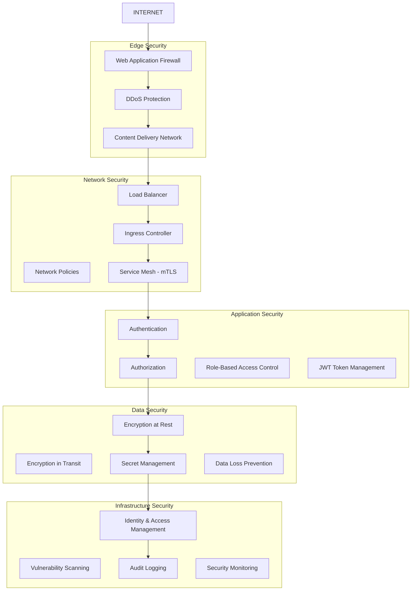

# Security Architecture and Compliance Framework

## Overview

This document outlines the comprehensive security architecture and compliance framework for the Enhanced Plugin Management System. The framework implements enterprise-grade security controls, ensuring data protection, access control, and regulatory compliance while maintaining high system performance and usability.

## Security Architecture Overview

### Defense in Depth Strategy



## Authentication and Authorization

### Multi-Factor Authentication (MFA)
```typescript
// MFA implementation using TOTP
import speakeasy from 'speakeasy';
import qrcode from 'qrcode';
import { User } from '../models/User';

interface MFASetupResult {
  secret: string;
  qrCodeUrl: string;
  backupCodes: string[];
}

export class MFAService {
  public async setupMFA(userId: string): Promise<MFASetupResult> {
    const user = await User.findById(userId);
    if (!user) {
      throw new Error('User not found');
    }

    // Generate secret
    const secret = speakeasy.generateSecret({
      name: `Portal (${user.email})`,
      issuer: 'Portal Company',
      length: 32
    });

    // Generate QR code
    const qrCodeUrl = await qrcode.toDataURL(secret.otpauth_url);

    // Generate backup codes
    const backupCodes = this.generateBackupCodes();

    // Store encrypted secret and backup codes
    await user.updateMFASettings({
      secret: this.encrypt(secret.base32),
      backupCodes: backupCodes.map(code => this.hash(code)),
      enabled: false // Will be enabled after verification
    });

    return {
      secret: secret.base32,
      qrCodeUrl,
      backupCodes
    };
  }

  public async verifyMFA(userId: string, token: string): Promise<boolean> {
    const user = await User.findById(userId);
    if (!user || !user.mfaSecret) {
      return false;
    }

    const decryptedSecret = this.decrypt(user.mfaSecret);
    
    // Verify TOTP token
    const verified = speakeasy.totp.verify({
      secret: decryptedSecret,
      encoding: 'base32',
      token,
      window: 2 // Allow 2 time steps tolerance
    });

    if (verified) {
      // Update last used timestamp to prevent replay
      await user.updateLastMFAUsed();
      return true;
    }

    // Check if it's a backup code
    return this.verifyBackupCode(userId, token);
  }

  private generateBackupCodes(): string[] {
    const codes = [];
    for (let i = 0; i < 10; i++) {
      codes.push(Math.random().toString(36).substr(2, 8).toUpperCase());
    }
    return codes;
  }

  private async verifyBackupCode(userId: string, code: string): Promise<boolean> {
    const user = await User.findById(userId);
    const hashedCode = this.hash(code);
    
    const codeIndex = user.backupCodes.indexOf(hashedCode);
    if (codeIndex !== -1) {
      // Remove used backup code
      user.backupCodes.splice(codeIndex, 1);
      await user.save();
      return true;
    }
    
    return false;
  }
}
```

### JWT Token Management with Refresh Tokens
```typescript
// JWT token management with secure refresh mechanism
import jwt from 'jsonwebtoken';
import { randomBytes } from 'crypto';
import { Redis } from 'ioredis';

interface TokenPayload {
  userId: string;
  email: string;
  organizationId: string;
  roles: string[];
  permissions: string[];
  sessionId: string;
}

interface TokenPair {
  accessToken: string;
  refreshToken: string;
  expiresAt: Date;
}

export class TokenService {
  private redis: Redis;
  private accessTokenSecret: string;
  private refreshTokenSecret: string;
  private accessTokenExpiry = '15m';
  private refreshTokenExpiry = '7d';

  constructor(redis: Redis) {
    this.redis = redis;
    this.accessTokenSecret = process.env.JWT_ACCESS_SECRET!;
    this.refreshTokenSecret = process.env.JWT_REFRESH_SECRET!;
  }

  public async generateTokens(payload: TokenPayload): Promise<TokenPair> {
    const sessionId = randomBytes(32).toString('hex');
    const now = new Date();
    const accessExpiresAt = new Date(now.getTime() + 15 * 60 * 1000); // 15 minutes
    const refreshExpiresAt = new Date(now.getTime() + 7 * 24 * 60 * 60 * 1000); // 7 days

    // Generate access token
    const accessToken = jwt.sign(
      { ...payload, sessionId, type: 'access' },
      this.accessTokenSecret,
      { expiresIn: this.accessTokenExpiry }
    );

    // Generate refresh token
    const refreshToken = jwt.sign(
      { userId: payload.userId, sessionId, type: 'refresh' },
      this.refreshTokenSecret,
      { expiresIn: this.refreshTokenExpiry }
    );

    // Store session information in Redis
    await this.redis.hset(`session:${sessionId}`, {
      userId: payload.userId,
      organizationId: payload.organizationId,
      refreshToken,
      createdAt: now.toISOString(),
      expiresAt: refreshExpiresAt.toISOString(),
      lastActivity: now.toISOString()
    });

    // Set expiration for session
    await this.redis.expire(`session:${sessionId}`, 7 * 24 * 60 * 60); // 7 days

    return {
      accessToken,
      refreshToken,
      expiresAt: accessExpiresAt
    };
  }

  public async refreshTokens(refreshToken: string): Promise<TokenPair> {
    try {
      // Verify refresh token
      const decoded = jwt.verify(refreshToken, this.refreshTokenSecret) as any;
      
      if (decoded.type !== 'refresh') {
        throw new Error('Invalid token type');
      }

      // Check if session exists and is valid
      const sessionData = await this.redis.hgetall(`session:${decoded.sessionId}`);
      if (!sessionData || sessionData.refreshToken !== refreshToken) {
        throw new Error('Invalid session');
      }

      // Get user data for new token
      const user = await User.findById(decoded.userId);
      if (!user) {
        throw new Error('User not found');
      }

      // Generate new token pair
      const newTokens = await this.generateTokens({
        userId: user.id,
        email: user.email,
        organizationId: user.organizationId,
        roles: user.roles,
        permissions: user.permissions,
        sessionId: decoded.sessionId
      });

      // Update session activity
      await this.redis.hset(`session:${decoded.sessionId}`, {
        lastActivity: new Date().toISOString()
      });

      return newTokens;
    } catch (error) {
      throw new Error('Invalid refresh token');
    }
  }

  public async revokeSession(sessionId: string): Promise<void> {
    await this.redis.del(`session:${sessionId}`);
  }

  public async revokeAllSessions(userId: string): Promise<void> {
    const sessionKeys = await this.redis.keys(`session:*`);
    for (const key of sessionKeys) {
      const sessionData = await this.redis.hgetall(key);
      if (sessionData.userId === userId) {
        await this.redis.del(key);
      }
    }
  }
}
```

### Role-Based Access Control (RBAC)
```typescript
// Advanced RBAC with hierarchical roles and permissions
interface Permission {
  id: string;
  name: string;
  resource: string;
  action: string;
  conditions?: Record<string, any>;
}

interface Role {
  id: string;
  name: string;
  permissions: string[];
  inherits?: string[]; // Role hierarchy
  organizationId?: string; // Organization-specific roles
}

interface PolicyContext {
  userId: string;
  organizationId: string;
  resourceId?: string;
  resourceType?: string;
  metadata?: Record<string, any>;
}

export class RBACService {
  private permissions: Map<string, Permission> = new Map();
  private roles: Map<string, Role> = new Map();

  public async evaluatePermission(
    userId: string, 
    permission: string, 
    context: PolicyContext
  ): Promise<boolean> {
    const user = await User.findById(userId);
    if (!user) return false;

    // Get user roles (direct and inherited)
    const userRoles = await this.getUserRoles(userId, context.organizationId);
    
    // Get all permissions from roles
    const userPermissions = await this.getPermissionsFromRoles(userRoles);
    
    // Check if user has the required permission
    const hasPermission = userPermissions.some(perm => 
      this.matchesPermission(perm, permission, context)
    );

    // Log access attempt for audit
    await this.logAccessAttempt(userId, permission, context, hasPermission);

    return hasPermission;
  }

  private async getUserRoles(userId: string, organizationId: string): Promise<Role[]> {
    const user = await User.findById(userId);
    const roles: Role[] = [];

    // Add user's direct roles
    for (const roleId of user.roles) {
      const role = await this.getRole(roleId, organizationId);
      if (role) roles.push(role);
    }

    // Add inherited roles
    const inheritedRoles = await this.getInheritedRoles(roles);
    roles.push(...inheritedRoles);

    return roles;
  }

  private async getInheritedRoles(roles: Role[]): Promise<Role[]> {
    const inherited: Role[] = [];
    const processed = new Set<string>();

    for (const role of roles) {
      if (role.inherits) {
        for (const inheritedRoleId of role.inherits) {
          if (!processed.has(inheritedRoleId)) {
            const inheritedRole = this.roles.get(inheritedRoleId);
            if (inheritedRole) {
              inherited.push(inheritedRole);
              processed.add(inheritedRoleId);

              // Recursively get inherited roles
              const deepInherited = await this.getInheritedRoles([inheritedRole]);
              inherited.push(...deepInherited);
            }
          }
        }
      }
    }

    return inherited;
  }

  private async getPermissionsFromRoles(roles: Role[]): Promise<Permission[]> {
    const permissions: Permission[] = [];
    const permissionIds = new Set<string>();

    for (const role of roles) {
      for (const permissionId of role.permissions) {
        if (!permissionIds.has(permissionId)) {
          const permission = this.permissions.get(permissionId);
          if (permission) {
            permissions.push(permission);
            permissionIds.add(permissionId);
          }
        }
      }
    }

    return permissions;
  }

  private matchesPermission(
    userPermission: Permission, 
    requiredPermission: string, 
    context: PolicyContext
  ): boolean {
    // Simple permission matching
    if (userPermission.name === requiredPermission) {
      return this.evaluateConditions(userPermission.conditions, context);
    }

    // Wildcard matching
    const permissionParts = requiredPermission.split(':');
    const userPermissionParts = userPermission.name.split(':');

    if (permissionParts.length !== userPermissionParts.length) {
      return false;
    }

    for (let i = 0; i < permissionParts.length; i++) {
      if (userPermissionParts[i] !== '*' && userPermissionParts[i] !== permissionParts[i]) {
        return false;
      }
    }

    return this.evaluateConditions(userPermission.conditions, context);
  }

  private evaluateConditions(
    conditions: Record<string, any> | undefined, 
    context: PolicyContext
  ): boolean {
    if (!conditions) return true;

    // Evaluate conditions like organization ownership, resource ownership, etc.
    for (const [key, value] of Object.entries(conditions)) {
      switch (key) {
        case 'organization':
          if (context.organizationId !== value) return false;
          break;
        case 'resource_owner':
          if (context.metadata?.ownerId !== context.userId) return false;
          break;
        case 'time_range':
          const now = new Date();
          const start = new Date(value.start);
          const end = new Date(value.end);
          if (now < start || now > end) return false;
          break;
      }
    }

    return true;
  }

  private async logAccessAttempt(
    userId: string, 
    permission: string, 
    context: PolicyContext, 
    granted: boolean
  ): Promise<void> {
    // Log to audit system
    await AuditLogger.log({
      event: 'access_control',
      userId,
      permission,
      context,
      granted,
      timestamp: new Date(),
      ip: context.metadata?.ip,
      userAgent: context.metadata?.userAgent
    });
  }
}

// Permission middleware
export function requirePermission(permission: string) {
  return async (req: Request, res: Response, next: NextFunction) => {
    try {
      const user = req.user as TokenPayload;
      const rbac = new RBACService();

      const hasPermission = await rbac.evaluatePermission(user.userId, permission, {
        userId: user.userId,
        organizationId: user.organizationId,
        resourceId: req.params.id,
        resourceType: req.baseUrl.split('/').pop(),
        metadata: {
          ip: req.ip,
          userAgent: req.get('User-Agent')
        }
      });

      if (!hasPermission) {
        return res.status(403).json({
          error: 'Insufficient permissions',
          required: permission
        });
      }

      next();
    } catch (error) {
      return res.status(500).json({
        error: 'Authorization check failed'
      });
    }
  };
}
```

## Data Protection

### Encryption at Rest
```typescript
// Database encryption using field-level encryption
import { AES, enc } from 'crypto-js';
import { createHash, randomBytes } from 'crypto';

export class EncryptionService {
  private masterKey: string;
  private keyDerivationSalt: string;

  constructor() {
    this.masterKey = process.env.MASTER_ENCRYPTION_KEY!;
    this.keyDerivationSalt = process.env.KEY_DERIVATION_SALT!;
  }

  public encryptPII(data: string, context?: string): string {
    const derivedKey = this.deriveKey(context);
    const iv = randomBytes(16);
    
    const encrypted = AES.encrypt(data, derivedKey, {
      iv: enc.Hex.parse(iv.toString('hex'))
    }).toString();

    // Return IV + encrypted data
    return iv.toString('hex') + ':' + encrypted;
  }

  public decryptPII(encryptedData: string, context?: string): string {
    const [ivHex, encrypted] = encryptedData.split(':');
    const derivedKey = this.deriveKey(context);
    
    const decrypted = AES.decrypt(encrypted, derivedKey, {
      iv: enc.Hex.parse(ivHex)
    });

    return decrypted.toString(enc.Utf8);
  }

  private deriveKey(context?: string): string {
    const keyMaterial = this.masterKey + (context || '');
    return createHash('sha256')
      .update(keyMaterial + this.keyDerivationSalt)
      .digest('hex');
  }

  public encryptSensitiveFields(data: Record<string, any>): Record<string, any> {
    const sensitiveFields = ['email', 'phone', 'ssn', 'creditCard'];
    const encrypted = { ...data };

    for (const field of sensitiveFields) {
      if (encrypted[field]) {
        encrypted[field] = this.encryptPII(encrypted[field], field);
      }
    }

    return encrypted;
  }

  public decryptSensitiveFields(data: Record<string, any>): Record<string, any> {
    const sensitiveFields = ['email', 'phone', 'ssn', 'creditCard'];
    const decrypted = { ...data };

    for (const field of sensitiveFields) {
      if (decrypted[field] && decrypted[field].includes(':')) {
        try {
          decrypted[field] = this.decryptPII(decrypted[field], field);
        } catch (error) {
          // Log decryption error but don't expose sensitive data
          console.error(`Decryption failed for field ${field}`);
          decrypted[field] = '[DECRYPTION_ERROR]';
        }
      }
    }

    return decrypted;
  }
}
```

### Secrets Management with HashiCorp Vault
```typescript
// Vault integration for dynamic secrets
import VaultClient from 'node-vault';

interface SecretConfig {
  path: string;
  mount?: string;
  ttl?: number;
  renewable?: boolean;
}

export class VaultService {
  private client: VaultClient.client;

  constructor() {
    this.client = VaultClient({
      apiVersion: 'v1',
      endpoint: process.env.VAULT_ENDPOINT!,
      token: process.env.VAULT_TOKEN
    });
  }

  public async getSecret(path: string): Promise<any> {
    try {
      const response = await this.client.read(path);
      return response.data;
    } catch (error) {
      console.error(`Failed to retrieve secret from ${path}:`, error);
      throw new Error('Secret retrieval failed');
    }
  }

  public async getDatabaseCredentials(database: string): Promise<{
    username: string;
    password: string;
    ttl: number;
  }> {
    const path = `database/creds/${database}`;
    const credentials = await this.getSecret(path);
    
    return {
      username: credentials.username,
      password: credentials.password,
      ttl: credentials.lease_duration
    };
  }

  public async getAPIKey(service: string): Promise<string> {
    const path = `secret/data/api-keys/${service}`;
    const secret = await this.getSecret(path);
    return secret.data.key;
  }

  public async rotateSecret(path: string, newValue: any): Promise<void> {
    await this.client.write(path, newValue);
  }

  public async createPolicy(name: string, policies: string[]): Promise<void> {
    const policy = policies.join('\n');
    await this.client.write(`sys/policies/acl/${name}`, {
      policy
    });
  }

  // Automated secret rotation
  public async scheduleSecretRotation(
    path: string, 
    rotationFunction: () => Promise<any>,
    intervalHours: number = 24
  ): Promise<void> {
    setInterval(async () => {
      try {
        const newSecret = await rotationFunction();
        await this.rotateSecret(path, newSecret);
        console.log(`Successfully rotated secret at ${path}`);
      } catch (error) {
        console.error(`Failed to rotate secret at ${path}:`, error);
        // Send alert to monitoring system
        await this.sendRotationAlert(path, error);
      }
    }, intervalHours * 60 * 60 * 1000);
  }

  private async sendRotationAlert(path: string, error: Error): Promise<void> {
    // Implementation would send alert to monitoring/alerting system
    console.error(`ALERT: Secret rotation failed for ${path}`, error);
  }
}
```

## Network Security

### Service Mesh Security with Istio
```yaml
# Istio security configurations
# PeerAuthentication for mTLS
apiVersion: security.istio.io/v1beta1
kind: PeerAuthentication
metadata:
  name: portal-mtls
  namespace: developer-portal
spec:
  mtls:
    mode: STRICT
---
# AuthorizationPolicy for fine-grained access control
apiVersion: security.istio.io/v1beta1
kind: AuthorizationPolicy
metadata:
  name: portal-frontend-authz
  namespace: developer-portal
spec:
  selector:
    matchLabels:
      app: portal-frontend
  rules:
  - from:
    - source:
        principals: ["cluster.local/ns/istio-system/sa/istio-ingressgateway-service-account"]
  - from:
    - source:
        principals: ["cluster.local/ns/developer-portal/sa/backstage-backend"]
    to:
    - operation:
        methods: ["GET", "POST", "PUT", "DELETE"]
        paths: ["/api/*"]
---
# AuthorizationPolicy for backend services
apiVersion: security.istio.io/v1beta1
kind: AuthorizationPolicy
metadata:
  name: backstage-backend-authz
  namespace: developer-portal
spec:
  selector:
    matchLabels:
      app: backstage-backend
  rules:
  - from:
    - source:
        principals: ["cluster.local/ns/developer-portal/sa/portal-frontend"]
  - from:
    - source:
        namespaces: ["monitoring"]
    to:
    - operation:
        methods: ["GET"]
        paths: ["/metrics", "/healthcheck"]
  - when:
    - key: request.headers[authorization]
      values: ["Bearer *"]
```

### Network Policies
```yaml
# Kubernetes Network Policies for micro-segmentation
apiVersion: networking.k8s.io/v1
kind: NetworkPolicy
metadata:
  name: portal-frontend-netpol
  namespace: developer-portal
spec:
  podSelector:
    matchLabels:
      app: portal-frontend
  policyTypes:
  - Ingress
  - Egress
  ingress:
  - from:
    - namespaceSelector:
        matchLabels:
          name: istio-system
    ports:
    - protocol: TCP
      port: 4400
  - from:
    - podSelector:
        matchLabels:
          app: backstage-backend
    ports:
    - protocol: TCP
      port: 4400
  egress:
  - to:
    - podSelector:
        matchLabels:
          app: backstage-backend
    ports:
    - protocol: TCP
      port: 7007
  - to:
    - podSelector:
        matchLabels:
          app: redis
    ports:
    - protocol: TCP
      port: 6379
  - to: []
    ports:
    - protocol: TCP
      port: 443
    - protocol: UDP
      port: 53
---
apiVersion: networking.k8s.io/v1
kind: NetworkPolicy
metadata:
  name: backstage-backend-netpol
  namespace: developer-portal
spec:
  podSelector:
    matchLabels:
      app: backstage-backend
  policyTypes:
  - Ingress
  - Egress
  ingress:
  - from:
    - podSelector:
        matchLabels:
          app: portal-frontend
    ports:
    - protocol: TCP
      port: 7007
  - from:
    - namespaceSelector:
        matchLabels:
          name: monitoring
    ports:
    - protocol: TCP
      port: 9090
  egress:
  - to:
    - podSelector:
        matchLabels:
          app: postgres
    ports:
    - protocol: TCP
      port: 5432
  - to:
    - podSelector:
        matchLabels:
          app: redis
    ports:
    - protocol: TCP
      port: 6379
  - to: []
    ports:
    - protocol: TCP
      port: 443
    - protocol: UDP
      port: 53
```

## Security Monitoring and Incident Response

### Security Event Monitoring
```typescript
// Security event monitoring and alerting
import { EventEmitter } from 'events';

interface SecurityEvent {
  type: string;
  severity: 'low' | 'medium' | 'high' | 'critical';
  source: string;
  userId?: string;
  ip?: string;
  userAgent?: string;
  details: Record<string, any>;
  timestamp: Date;
}

export class SecurityMonitor extends EventEmitter {
  private suspiciousActivities: Map<string, number> = new Map();
  private rateLimit: Map<string, { count: number; resetTime: number }> = new Map();

  public logSecurityEvent(event: SecurityEvent): void {
    // Log to security audit system
    this.logToAuditSystem(event);

    // Check for suspicious patterns
    this.analyzeForThreats(event);

    // Emit event for real-time processing
    this.emit('securityEvent', event);

    // Handle critical events immediately
    if (event.severity === 'critical') {
      this.handleCriticalEvent(event);
    }
  }

  private async analyzeForThreats(event: SecurityEvent): Promise<void> {
    // Brute force detection
    if (event.type === 'login_failed' && event.userId) {
      const failedAttempts = this.incrementFailedAttempts(event.userId);
      if (failedAttempts >= 5) {
        await this.triggerBruteForceAlert(event);
      }
    }

    // Rate limiting detection
    if (event.ip) {
      const requests = this.trackRateLimit(event.ip);
      if (requests > 100) { // 100 requests per minute
        await this.triggerRateLimitAlert(event);
      }
    }

    // Anomalous behavior detection
    if (event.type === 'privilege_escalation') {
      await this.triggerPrivilegeEscalationAlert(event);
    }

    // Suspicious file access
    if (event.type === 'file_access' && this.isSensitiveFile(event.details.file)) {
      await this.triggerSensitiveAccessAlert(event);
    }
  }

  private incrementFailedAttempts(userId: string): number {
    const current = this.suspiciousActivities.get(`failed_login:${userId}`) || 0;
    const newCount = current + 1;
    this.suspiciousActivities.set(`failed_login:${userId}`, newCount);

    // Reset counter after 15 minutes
    setTimeout(() => {
      this.suspiciousActivities.delete(`failed_login:${userId}`);
    }, 15 * 60 * 1000);

    return newCount;
  }

  private trackRateLimit(ip: string): number {
    const now = Date.now();
    const key = `rate_limit:${ip}`;
    const current = this.rateLimit.get(key);

    if (!current || now > current.resetTime) {
      this.rateLimit.set(key, { count: 1, resetTime: now + 60000 }); // 1 minute window
      return 1;
    } else {
      current.count++;
      return current.count;
    }
  }

  private async triggerBruteForceAlert(event: SecurityEvent): Promise<void> {
    await this.sendAlert({
      type: 'brute_force_detected',
      severity: 'high',
      message: `Brute force attack detected for user ${event.userId}`,
      event,
      actions: ['block_ip', 'notify_user', 'require_mfa']
    });

    // Automatically block IP temporarily
    await this.blockIP(event.ip!, 3600); // Block for 1 hour
  }

  private async triggerRateLimitAlert(event: SecurityEvent): Promise<void> {
    await this.sendAlert({
      type: 'rate_limit_exceeded',
      severity: 'medium',
      message: `Rate limit exceeded for IP ${event.ip}`,
      event,
      actions: ['throttle_requests', 'block_ip_temporary']
    });
  }

  private async triggerPrivilegeEscalationAlert(event: SecurityEvent): Promise<void> {
    await this.sendAlert({
      type: 'privilege_escalation',
      severity: 'critical',
      message: `Potential privilege escalation detected`,
      event,
      actions: ['immediate_investigation', 'disable_user', 'notify_security_team']
    });
  }

  private async handleCriticalEvent(event: SecurityEvent): Promise<void> {
    // Immediate response actions
    switch (event.type) {
      case 'data_breach_suspected':
        await this.initiateIncidentResponse('data_breach', event);
        break;
      case 'unauthorized_admin_access':
        await this.lockdownAdminAccess(event);
        break;
      case 'malware_detected':
        await this.quarantineSystem(event);
        break;
    }
  }

  private async initiateIncidentResponse(incidentType: string, event: SecurityEvent): Promise<void> {
    // Create incident ticket
    const incidentId = await this.createIncidentTicket(incidentType, event);
    
    // Notify security team
    await this.notifySecurityTeam(incidentId, event);
    
    // Activate incident response procedures
    await this.activateIncidentResponse(incidentId);
  }

  private isSensitiveFile(filePath: string): boolean {
    const sensitivePatterns = [
      /\/etc\/passwd/,
      /\/etc\/shadow/,
      /\.env$/,
      /config\.json$/,
      /secrets\//,
      /private_key/
    ];

    return sensitivePatterns.some(pattern => pattern.test(filePath));
  }

  private async logToAuditSystem(event: SecurityEvent): Promise<void> {
    // Implementation would log to centralized audit system
    console.log('SECURITY_AUDIT:', JSON.stringify(event, null, 2));
  }

  private async sendAlert(alert: any): Promise<void> {
    // Implementation would send to alerting system (Slack, PagerDuty, etc.)
    console.log('SECURITY_ALERT:', JSON.stringify(alert, null, 2));
  }

  private async blockIP(ip: string, duration: number): Promise<void> {
    // Implementation would add IP to firewall block list
    console.log(`Blocking IP ${ip} for ${duration} seconds`);
  }

  private async createIncidentTicket(type: string, event: SecurityEvent): Promise<string> {
    // Implementation would create ticket in incident management system
    return `INC-${Date.now()}`;
  }

  private async notifySecurityTeam(incidentId: string, event: SecurityEvent): Promise<void> {
    // Implementation would notify security team via multiple channels
    console.log(`INCIDENT ${incidentId}: ${event.type}`);
  }

  private async activateIncidentResponse(incidentId: string): Promise<void> {
    // Implementation would trigger incident response procedures
    console.log(`Activating incident response for ${incidentId}`);
  }

  private async lockdownAdminAccess(event: SecurityEvent): Promise<void> {
    // Implementation would temporarily disable admin functions
    console.log('Locking down admin access due to security event');
  }

  private async quarantineSystem(event: SecurityEvent): Promise<void> {
    // Implementation would isolate affected systems
    console.log('Quarantining system due to malware detection');
  }
}
```

## Compliance Framework

### GDPR Compliance Implementation
```typescript
// GDPR compliance utilities
interface DataSubjectRights {
  accessRequest: (userId: string) => Promise<any>;
  rectificationRequest: (userId: string, corrections: any) => Promise<void>;
  erasureRequest: (userId: string) => Promise<void>;
  restrictProcessing: (userId: string) => Promise<void>;
  dataPortability: (userId: string) => Promise<any>;
  objectToProcessing: (userId: string, processingType: string) => Promise<void>;
}

export class GDPRComplianceService implements DataSubjectRights {
  private encryptionService: EncryptionService;
  private auditLogger: AuditLogger;

  constructor() {
    this.encryptionService = new EncryptionService();
    this.auditLogger = new AuditLogger();
  }

  public async accessRequest(userId: string): Promise<any> {
    await this.auditLogger.log({
      action: 'gdpr_access_request',
      userId,
      timestamp: new Date()
    });

    // Collect all personal data across systems
    const userData = await this.collectAllUserData(userId);
    
    // Decrypt sensitive data for the user
    const decryptedData = this.encryptionService.decryptSensitiveFields(userData);
    
    // Remove internal system fields
    const sanitizedData = this.sanitizeInternalFields(decryptedData);
    
    return {
      personalData: sanitizedData,
      dataProcessingActivities: await this.getProcessingActivities(userId),
      dataRetentionPolicies: await this.getRetentionPolicies(),
      thirdPartyDataSharing: await this.getThirdPartySharing(userId)
    };
  }

  public async rectificationRequest(userId: string, corrections: any): Promise<void> {
    await this.auditLogger.log({
      action: 'gdpr_rectification_request',
      userId,
      corrections,
      timestamp: new Date()
    });

    // Validate corrections
    const validatedCorrections = await this.validateCorrections(corrections);
    
    // Update user data
    await this.updateUserData(userId, validatedCorrections);
    
    // Propagate changes to connected systems
    await this.propagateDataChanges(userId, validatedCorrections);
  }

  public async erasureRequest(userId: string): Promise<void> {
    await this.auditLogger.log({
      action: 'gdpr_erasure_request',
      userId,
      timestamp: new Date()
    });

    // Check if erasure is legally required or if we have legitimate grounds to retain
    const erasureAssessment = await this.assessErasureRequest(userId);
    
    if (erasureAssessment.canErase) {
      // Pseudonymize or delete personal data
      await this.erasePersonalData(userId);
      
      // Notify third parties
      await this.notifyThirdPartiesOfErasure(userId);
    } else {
      throw new Error(`Erasure request denied: ${erasureAssessment.reason}`);
    }
  }

  public async restrictProcessing(userId: string): Promise<void> {
    await this.auditLogger.log({
      action: 'gdpr_restrict_processing',
      userId,
      timestamp: new Date()
    });

    // Mark user data for restricted processing
    await this.markForRestrictedProcessing(userId);
    
    // Update processing activities
    await this.updateProcessingRestrictions(userId);
  }

  public async dataPortability(userId: string): Promise<any> {
    await this.auditLogger.log({
      action: 'gdpr_data_portability',
      userId,
      timestamp: new Date()
    });

    // Export data in machine-readable format
    const exportableData = await this.getExportableData(userId);
    
    return {
      format: 'JSON',
      data: exportableData,
      exportDate: new Date(),
      dataIntegrity: await this.calculateDataIntegrity(exportableData)
    };
  }

  public async objectToProcessing(userId: string, processingType: string): Promise<void> {
    await this.auditLogger.log({
      action: 'gdpr_object_to_processing',
      userId,
      processingType,
      timestamp: new Date()
    });

    // Evaluate objection
    const objectionAssessment = await this.assessProcessingObjection(userId, processingType);
    
    if (objectionAssessment.validObjection) {
      await this.stopProcessingActivity(userId, processingType);
    } else {
      throw new Error(`Objection denied: ${objectionAssessment.reason}`);
    }
  }

  private async collectAllUserData(userId: string): Promise<any> {
    // Implementation would collect data from all systems
    return {};
  }

  private async erasePersonalData(userId: string): Promise<void> {
    // Implementation would pseudonymize or delete personal data
    console.log(`Erasing personal data for user ${userId}`);
  }

  // ... other private methods
}
```

### SOC 2 Compliance Controls
```typescript
// SOC 2 compliance monitoring
interface SOC2Control {
  id: string;
  name: string;
  category: 'security' | 'availability' | 'processing_integrity' | 'confidentiality' | 'privacy';
  description: string;
  implementation: () => Promise<boolean>;
  evidence: () => Promise<any>;
}

export class SOC2ComplianceMonitor {
  private controls: SOC2Control[] = [];

  constructor() {
    this.initializeControls();
  }

  private initializeControls(): void {
    // Security controls
    this.controls.push({
      id: 'CC1.1',
      name: 'Control Environment',
      category: 'security',
      description: 'Management establishes structures, reporting lines, and appropriate authorities and responsibilities',
      implementation: async () => {
        // Check if security policies are in place and communicated
        return await this.checkSecurityPolicies();
      },
      evidence: async () => {
        return {
          securityPolicies: await this.getSecurityPolicies(),
          trainingRecords: await this.getTrainingRecords(),
          organizationalChart: await this.getOrganizationalChart()
        };
      }
    });

    this.controls.push({
      id: 'CC2.1',
      name: 'Communication and Information',
      category: 'security',
      description: 'Information security responsibilities are communicated',
      implementation: async () => {
        return await this.checkSecurityCommunication();
      },
      evidence: async () => {
        return {
          communicationLogs: await this.getCommunicationLogs(),
          securityAwareness: await this.getSecurityAwarenessMetrics()
        };
      }
    });

    // Availability controls
    this.controls.push({
      id: 'A1.1',
      name: 'Availability Monitoring',
      category: 'availability',
      description: 'System availability is monitored',
      implementation: async () => {
        return await this.checkAvailabilityMonitoring();
      },
      evidence: async () => {
        return {
          uptimeMetrics: await this.getUptimeMetrics(),
          monitoringAlerts: await this.getMonitoringAlerts(),
          incidentReports: await this.getIncidentReports()
        };
      }
    });

    // Add more controls...
  }

  public async runComplianceCheck(): Promise<{
    overallCompliance: number;
    controlResults: Array<{
      control: SOC2Control;
      compliant: boolean;
      evidence: any;
      lastChecked: Date;
    }>;
    recommendations: string[];
  }> {
    const results = [];
    const recommendations = [];
    let compliantControls = 0;

    for (const control of this.controls) {
      try {
        const compliant = await control.implementation();
        const evidence = await control.evidence();

        results.push({
          control,
          compliant,
          evidence,
          lastChecked: new Date()
        });

        if (compliant) {
          compliantControls++;
        } else {
          recommendations.push(`Implement control ${control.id}: ${control.name}`);
        }
      } catch (error) {
        results.push({
          control,
          compliant: false,
          evidence: { error: error.message },
          lastChecked: new Date()
        });
        recommendations.push(`Fix error in control ${control.id}: ${error.message}`);
      }
    }

    const overallCompliance = (compliantControls / this.controls.length) * 100;

    return {
      overallCompliance,
      controlResults: results,
      recommendations
    };
  }

  private async checkSecurityPolicies(): Promise<boolean> {
    // Implementation would verify security policies exist and are current
    return true;
  }

  private async checkSecurityCommunication(): Promise<boolean> {
    // Implementation would verify security communications
    return true;
  }

  private async checkAvailabilityMonitoring(): Promise<boolean> {
    // Implementation would verify monitoring systems
    return true;
  }

  // ... other check methods
}
```

This comprehensive security architecture and compliance framework provides enterprise-grade protection for the enhanced plugin management system, ensuring data security, regulatory compliance, and robust threat detection and response capabilities.