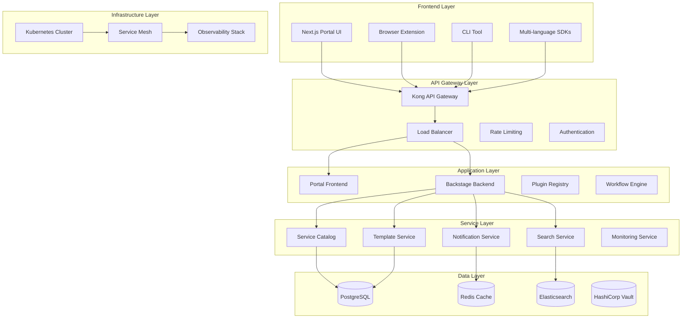
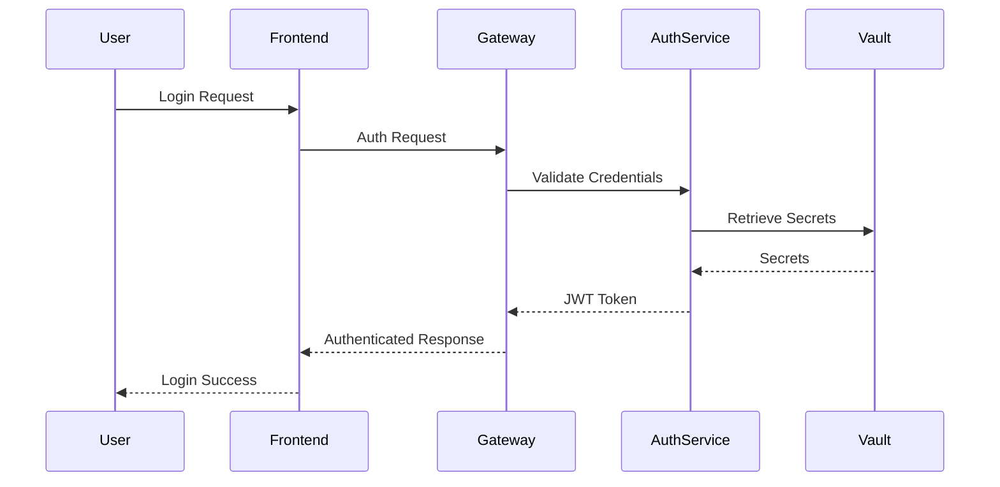

# System Architecture - Enhanced Plugin Management System

## Executive Summary

This document outlines the comprehensive system architecture for the enhanced plugin management system within the NEXT SaaS Internal Developer Portal. The architecture is designed for enterprise-scale deployments supporting thousands of developers across multiple organizations with high availability, security, and performance requirements.

## High-Level System Overview



## Component Architecture

### 1. Frontend Architecture

#### Next.js Portal Application
- **Technology Stack**: Next.js 15.4.4, React 19.1.0, TypeScript
- **State Management**: Zustand + React Query for server state
- **UI Framework**: Radix UI components with Tailwind CSS
- **Real-time Communication**: Socket.IO client for WebSocket connections

```typescript
// Component Structure
/src/
├── app/                    # Next.js App Router
├── components/            # Reusable UI components
├── hooks/                # Custom React hooks
├── lib/                  # Utility functions
├── pages/               # API routes and legacy pages
└── types/              # TypeScript definitions
```

#### Browser Extension
- **Architecture**: Background service worker + Content scripts
- **Communication**: Message passing with portal backend
- **Features**: Context-aware plugin suggestions, quick registration

#### CLI Tool
- **Framework**: Node.js with Commander.js
- **Authentication**: API key and OAuth2 support
- **Features**: Bulk operations, CI/CD integration, offline mode

### 2. Backend Architecture

#### Backstage Core Integration
- **Version**: Latest stable (1.x)
- **Custom Plugins**: Enhanced plugin registry, workflow orchestration
- **Authentication**: OAuth2, SAML, LDAP integration
- **Authorization**: RBAC with custom permission framework

#### Plugin Management System
```typescript
interface PluginArchitecture {
  registry: PluginRegistry;
  lifecycle: PluginLifecycleManager;
  dependencies: DependencyResolver;
  sandbox: SecuritySandbox;
  monitoring: PluginMonitoring;
}
```

#### Workflow Engine
- **Technology**: Custom workflow orchestrator built on Node.js
- **Features**: DAG-based workflows, conditional execution, rollback support
- **Integration**: Git providers, CI/CD systems, deployment platforms

### 3. Data Architecture

#### Primary Database (PostgreSQL)
```sql
-- Core Tables Structure
TABLES:
- plugins                 -- Plugin metadata and configurations
- workflows              -- Workflow definitions and state
- users                 -- User accounts and profiles
- organizations         -- Multi-tenant organization data
- permissions           -- RBAC permissions and roles
- audit_logs           -- Security and compliance audit trail
- metrics              -- System and plugin performance metrics
```

#### Caching Layer (Redis)
- **Session Management**: User sessions and JWT tokens
- **Performance Caching**: API response caching, plugin metadata
- **Real-time Features**: WebSocket connection state, notifications

#### Search Engine (Elasticsearch)
- **Indices**: plugins, workflows, documentation, users
- **Features**: Full-text search, faceted search, analytics
- **Performance**: Optimized for fast search across large datasets

#### Secret Management (HashiCorp Vault)
- **Secrets**: API keys, database credentials, OAuth tokens
- **Encryption**: Transparent data encryption with key rotation
- **Audit**: Complete audit trail for secret access

## Service Mesh Architecture

### Istio Configuration
```yaml
# Traffic Management
- Virtual Services: Routing, traffic splitting, fault injection
- Destination Rules: Load balancing, circuit breakers, TLS
- Gateways: Ingress/egress traffic control

# Security
- PeerAuthentication: mTLS enforcement
- AuthorizationPolicy: Fine-grained access control
- SecurityPolicy: Workload identity and certificates

# Observability
- Telemetry: Metrics, traces, access logs
- Grafana Integration: Service mesh dashboards
- Jaeger: Distributed tracing
```

## Scalability Architecture

### Horizontal Scaling Strategy
- **Frontend**: Auto-scaling based on CPU/memory usage
- **Backend**: Replica sets with intelligent load distribution
- **Database**: Read replicas with connection pooling
- **Cache**: Redis cluster with high availability

### Performance Optimizations
```typescript
// Caching Strategy
interface CacheStrategy {
  levels: ['Browser', 'CDN', 'API Gateway', 'Application', 'Database'];
  ttl: {
    static: '365d',
    dynamic: '1h',
    realTime: '30s'
  };
  invalidation: 'Event-driven cache invalidation';
}
```

## Security Architecture

### Authentication Flow


### Security Controls
- **Network Security**: Service mesh with mTLS
- **Application Security**: OWASP compliance, input validation
- **Data Security**: Encryption at rest and in transit
- **Access Control**: Zero-trust model with RBAC

## Integration Architecture

### External System Integration
```typescript
interface IntegrationPoints {
  gitProviders: ['GitHub', 'GitLab', 'Bitbucket'];
  cicd: ['Jenkins', 'GitHub Actions', 'GitLab CI'];
  monitoring: ['Prometheus', 'Grafana', 'DataDog'];
  cloud: ['AWS', 'GCP', 'Azure'];
  identity: ['LDAP', 'SAML', 'OAuth2'];
}
```

### API Architecture
- **REST APIs**: RESTful design with OpenAPI 3.0 specification
- **GraphQL**: Flexible data fetching for complex queries
- **WebSocket**: Real-time updates and notifications
- **Webhooks**: Event-driven integration with external systems

## Deployment Architecture

### Container Strategy
```dockerfile
# Multi-stage build optimization
FROM node:18-alpine AS builder
FROM node:18-alpine AS runner
# Optimized for production deployment
```

### Kubernetes Deployment
- **Namespaces**: Environment isolation (dev, staging, prod)
- **Service Accounts**: Pod-level security with minimal permissions
- **Network Policies**: Strict network segmentation
- **Resource Quotas**: CPU and memory limits per environment

## Monitoring and Observability

### Observability Stack
```yaml
Components:
  - Prometheus: Metrics collection and alerting
  - Grafana: Visualization and dashboards
  - Jaeger: Distributed tracing
  - Loki: Log aggregation
  - AlertManager: Alert routing and notification

Dashboards:
  - System Health: Overall system status
  - Plugin Performance: Plugin-specific metrics
  - User Experience: Frontend performance metrics
  - Security: Security events and anomalies
```

### Key Performance Indicators (KPIs)
- **System Availability**: 99.9% uptime SLA
- **Response Time**: &lt;200ms for API calls, &lt;2s for page loads
- **Plugin Installation**: &lt;30s average installation time
- **Error Rate**: &lt;0.1% for critical operations

## Disaster Recovery Architecture

### Backup Strategy
- **Database**: Continuous replication with point-in-time recovery
- **Configuration**: Infrastructure as Code with version control
- **Secrets**: Vault replication across multiple regions
- **Application State**: Stateless design with external state storage

### Failover Strategy
- **Multi-Region**: Active-passive deployment across regions
- **Health Checks**: Automated failure detection and routing
- **Recovery Time**: RTO &lt;15 minutes, RPO &lt;5 minutes

## Technology Decisions Rationale

### Framework Choices
1. **Next.js**: Server-side rendering, excellent developer experience
2. **Backstage**: Proven open-source IDP platform with strong ecosystem
3. **PostgreSQL**: ACID compliance, advanced features, excellent performance
4. **Redis**: High-performance caching and session management
5. **Kubernetes**: Industry-standard orchestration platform

### Architecture Patterns
1. **Microservices**: Independent deployment and scaling
2. **Event-Driven**: Loose coupling and real-time capabilities
3. **CQRS**: Separation of read and write operations for performance
4. **Circuit Breaker**: Fault tolerance and graceful degradation

## Performance Characteristics

### System Specifications
- **Concurrent Users**: 10,000+ simultaneous users
- **Plugin Registry**: 1,000+ plugins with metadata
- **Request Throughput**: 10,000+ requests per second
- **Data Storage**: Petabyte-scale storage capability
- **Geographic Distribution**: Multi-region deployment support

### Optimization Strategies
- **CDN Integration**: Global content delivery
- **Database Optimization**: Query optimization and indexing
- **Caching**: Multi-layer caching strategy
- **Asset Optimization**: Code splitting and lazy loading

## Future Architecture Considerations

### Planned Enhancements
1. **AI/ML Integration**: Intelligent plugin recommendations
2. **GraphQL Federation**: Unified API layer across services
3. **WebAssembly**: High-performance plugin execution
4. **Edge Computing**: Closer to user deployment
5. **Blockchain**: Immutable audit trail for compliance

### Technology Evolution
- **Cloud-Native**: Full migration to cloud-native architecture
- **Serverless**: Function-as-a-Service for specific workloads
- **NoSQL Integration**: Document databases for flexible schemas
- **Real-time Analytics**: Stream processing for immediate insights

## Compliance and Governance

### Regulatory Compliance
- **SOC 2 Type II**: Security and availability controls
- **GDPR**: Data protection and privacy compliance
- **ISO 27001**: Information security management
- **PCI DSS**: Payment card industry compliance (if applicable)

### Data Governance
- **Data Classification**: Sensitive data identification and handling
- **Data Retention**: Automated data lifecycle management
- **Access Controls**: Role-based and attribute-based access
- **Audit Trails**: Complete audit trail for all operations

This architecture document provides the foundation for building and maintaining a robust, scalable, and secure plugin management system that meets enterprise requirements while maintaining high performance and availability.