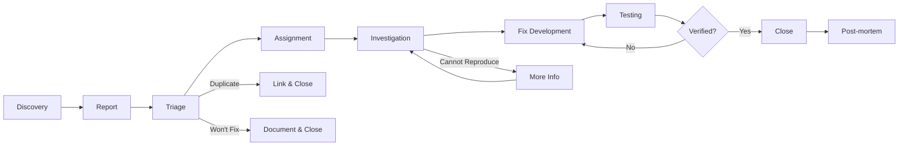
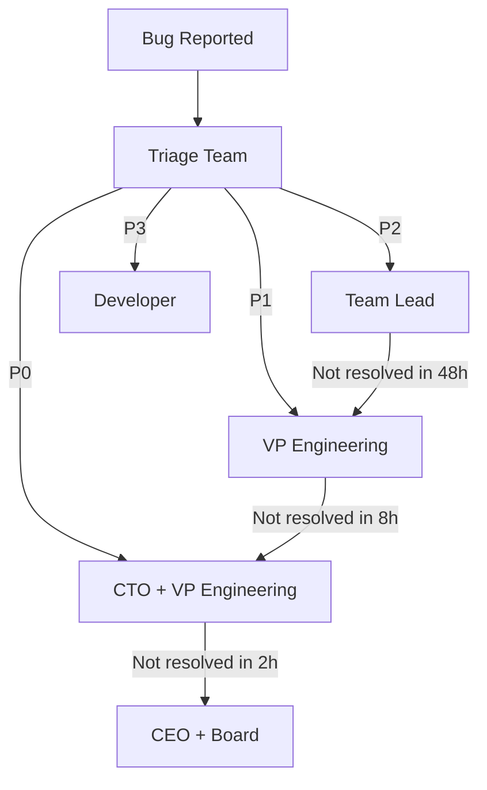

# Bug Tracking & Triage Process
## NEXT Internal Developer Portal

### Executive Summary
This document establishes a comprehensive bug tracking, triage, and resolution process for the NEXT IDP platform, ensuring rapid identification, prioritization, and resolution of issues throughout the software development lifecycle.

---

## Bug Lifecycle Management

### Bug Lifecycle Flow


---

## Bug Classification System

### Severity Levels

#### P0 - Critical (System Down)
**Definition:** Complete system failure or data loss
**Response Time:** Immediate (within 15 minutes)
**Examples:**
- Authentication system failure
- Data corruption or loss
- Security breach
- Complete service outage
- Payment processing failure

**SLA:**
- Acknowledgment: 15 minutes
- Initial Response: 30 minutes
- Resolution Target: 4 hours
- Escalation: Automatic after 2 hours

#### P1 - High (Major Feature Broken)
**Definition:** Core functionality unavailable, no workaround
**Response Time:** Within 1 hour
**Examples:**
- Template execution failing
- Dashboard not loading
- Catalog search broken
- Critical API endpoints down
- Deployment pipeline blocked

**SLA:**
- Acknowledgment: 1 hour
- Initial Response: 2 hours
- Resolution Target: 24 hours
- Escalation: After 8 hours

#### P2 - Medium (Feature Degraded)
**Definition:** Feature partially working or workaround available
**Response Time:** Within 4 hours
**Examples:**
- Slow performance (>10s load time)
- UI rendering issues
- Non-critical integration failures
- Export functionality broken
- Minor data inconsistencies

**SLA:**
- Acknowledgment: 4 hours
- Initial Response: 8 hours
- Resolution Target: 72 hours
- Escalation: After 48 hours

#### P3 - Low (Minor Issue)
**Definition:** Cosmetic or minor functionality issues
**Response Time:** Within 24 hours
**Examples:**
- UI alignment issues
- Typos in interface
- Non-blocking warnings
- Feature enhancement requests
- Documentation errors

**SLA:**
- Acknowledgment: 24 hours
- Initial Response: 48 hours
- Resolution Target: Next release
- Escalation: Not required

### Impact Assessment Matrix

```
         Impact →
    ↓    High    Medium    Low
    S    
    e  High     P0      P1      P2
    v    
    e  Medium   P1      P2      P3
    r    
    i  Low      P2      P3      P3
    t
    y
```

---

## Bug Reporting Process

### Bug Report Template
```markdown
## Bug Report

### Summary
[One line description of the bug]

### Environment
- **Version:** [e.g., v1.2.3]
- **Browser:** [e.g., Chrome 120]
- **OS:** [e.g., macOS 14.0]
- **User Role:** [e.g., Admin, Developer]
- **Instance:** [Production/Staging/Local]

### Steps to Reproduce
1. Navigate to [URL]
2. Click on [Element]
3. Enter [Data]
4. Observe [Result]

### Expected Behavior
[What should happen]

### Actual Behavior
[What actually happens]

### Screenshots/Videos
[Attach relevant media]

### Console Errors
```
[Paste any console errors]
```

### Additional Context
- Frequency: [Always/Sometimes/Rarely]
- First Occurrence: [Date/Time]
- Affected Users: [Count/Percentage]
- Business Impact: [Description]

### Workaround
[If any workaround exists]
```

### Automated Bug Collection

#### Error Tracking Integration
```typescript
// Sentry Integration
import * as Sentry from '@sentry/nextjs';

Sentry.init({
  dsn: process.env.SENTRY_DSN,
  environment: process.env.NODE_ENV,
  beforeSend(event, hint) {
    // Auto-create bug tickets for critical errors
    if (event.level === 'error' && shouldCreateTicket(event)) {
      createBugTicket({
        title: event.message || 'Automated Bug Report',
        description: formatSentryEvent(event),
        severity: calculateSeverity(event),
        stackTrace: event.exception?.values?.[0]?.stacktrace,
        user: event.user,
        tags: event.tags,
        fingerprint: event.fingerprint
      });
    }
    return event;
  }
});
```

#### Log Monitoring
```javascript
// Winston Log Monitor
const winston = require('winston');

const bugLogger = winston.createLogger({
  format: winston.format.combine(
    winston.format.timestamp(),
    winston.format.errors({ stack: true }),
    winston.format.json()
  ),
  transports: [
    new winston.transports.File({ 
      filename: 'bugs.log',
      level: 'error' 
    })
  ]
});

// Auto-create tickets for patterns
bugLogger.on('logged', (info) => {
  if (matchesCriticalPattern(info.message)) {
    createBugTicket({
      source: 'automated',
      log: info
    });
  }
});
```

---

## Triage Process

### Daily Triage Meeting
**Time:** 9:00 AM Daily  
**Duration:** 30 minutes  
**Participants:** QA Lead, Dev Lead, Product Owner

#### Triage Checklist
```markdown
For each new bug:
- [ ] Verify bug is reproducible
- [ ] Check for duplicates
- [ ] Assess severity and impact
- [ ] Assign priority level
- [ ] Determine affected components
- [ ] Assign to appropriate team/developer
- [ ] Set target resolution date
- [ ] Add to sprint if P0/P1
- [ ] Update stakeholders if critical
```

### Triage Decision Tree
```
New Bug Reported
    ↓
Is it reproducible?
    ├─ No → Request more information
    │        ↓
    │    Still not reproducible?
    │        ├─ Yes → Close as "Cannot Reproduce"
    │        └─ No → Continue
    └─ Yes ↓
Is it a duplicate?
    ├─ Yes → Link to original & close
    └─ No ↓
Is it a security issue?
    ├─ Yes → Flag as security & escalate
    └─ No ↓
Determine severity (P0-P3)
    ↓
Assign to team based on component
    ↓
Set SLA based on priority
```

### Assignment Rules

#### Component Ownership
| Component | Team | Lead | Backup |
|-----------|------|------|--------|
| Authentication | Security Team | @john.doe | @jane.smith |
| Dashboard | Frontend Team | @alice.johnson | @bob.williams |
| Catalog | Backend Team | @charlie.brown | @diana.prince |
| Templates | Platform Team | @eve.anderson | @frank.miller |
| Kubernetes | DevOps Team | @grace.hopper | @alan.turing |
| Cost Management | FinOps Team | @isaac.newton | @marie.curie |

#### Skill-Based Routing
```javascript
const assignBug = (bug) => {
  const rules = [
    { 
      condition: bug.tags.includes('performance'),
      assignee: 'performance-team'
    },
    {
      condition: bug.component === 'auth' && bug.severity === 'P0',
      assignee: 'security-lead'
    },
    {
      condition: bug.type === 'ui' && bug.browser === 'safari',
      assignee: 'cross-browser-specialist'
    }
  ];
  
  return rules.find(rule => rule.condition)?.assignee || 'triage-queue';
};
```

---

## Bug Resolution Process

### Investigation Phase
```markdown
## Investigation Checklist
- [ ] Reproduce bug in development environment
- [ ] Identify root cause
- [ ] Check git history for recent changes
- [ ] Review related code and tests
- [ ] Assess impact on other features
- [ ] Document findings in ticket
- [ ] Propose solution approach
- [ ] Estimate fix effort
```

### Fix Development Guidelines
```typescript
// Bug Fix Branch Naming
feature/BUG-1234-fix-login-timeout

// Commit Message Format
fix(auth): resolve session timeout issue

- Root cause: JWT expiration not handled properly
- Solution: Implement token refresh mechanism
- Testing: Added unit and integration tests

Fixes: BUG-1234
```

### Testing Requirements

#### Test Coverage for Bug Fixes
1. **Unit Test** - Test the specific fix
2. **Integration Test** - Test component interactions
3. **Regression Test** - Ensure no new bugs introduced
4. **E2E Test** - Validate user workflow

```typescript
describe('BUG-1234: Session Timeout Fix', () => {
  it('should refresh token before expiration', async () => {
    // Test implementation
  });
  
  it('should handle refresh failure gracefully', async () => {
    // Test error scenario
  });
  
  it('should not affect other auth flows', async () => {
    // Regression test
  });
});
```

---

## Bug Tracking Tools

### Primary Tool: Jira Configuration
```yaml
project: NEXT-IDP
issue_types:
  - Bug
  - Security Bug
  - Performance Bug
  
workflows:
  bug_workflow:
    states:
      - Open
      - In Triage
      - Assigned
      - In Progress
      - In Review
      - In Testing
      - Verified
      - Closed
      - Reopened
    
transitions:
  - from: Open
    to: In Triage
    condition: Triage team assigned
    
  - from: In Testing
    to: Verified
    condition: QA approval
    
custom_fields:
  - name: Severity
    type: select
    options: [P0, P1, P2, P3]
    
  - name: Component
    type: multi-select
    
  - name: Customer Impact
    type: text
    
  - name: Root Cause
    type: text
    
  - name: Fix Version
    type: version-picker
```

### Alternative: GitHub Issues
```markdown
## Bug Labels
- bug
- priority: critical
- priority: high
- priority: medium
- priority: low
- status: needs-triage
- status: in-progress
- status: needs-review
- status: ready-for-test
- component: auth
- component: dashboard
- type: regression
- type: security
```

### Bug Tracking Dashboard
```
┌────────────────────────────────────────────┐
│           Bug Status Overview              │
├────────────────────────────────────────────┤
│ Open Bugs by Priority                      │
│ P0: 0  P1: 3  P2: 12  P3: 24              │
├────────────────────────────────────────────┤
│ Trend (Last 30 Days)                       │
│ [Graph showing bug discovery vs resolution]│
├────────────────────────────────────────────┤
│ Top Components                             │
│ • Dashboard (8 bugs)                       │
│ • Catalog (6 bugs)                         │
│ • Templates (5 bugs)                       │
├────────────────────────────────────────────┤
│ SLA Compliance                             │
│ P0: 100% ✅  P1: 92% ✅  P2: 88% ⚠️       │
└────────────────────────────────────────────┘
```

---

## Escalation Process

### Escalation Matrix


### Communication Templates

#### P0 Critical Bug Alert
```markdown
🚨 **CRITICAL BUG ALERT** 🚨

**Bug ID:** BUG-1234
**Summary:** Authentication system failure
**Impact:** All users unable to login
**Affected Users:** 100% (10,000+ users)
**Started:** 2025-01-07 14:30 UTC
**Current Status:** Investigation in progress

**Response Team:**
- Incident Lead: @john.doe
- Engineering: @jane.smith
- Communications: @bob.jones

**Updates:** Every 30 minutes in #incident-response
**Status Page:** status.example.com
```

#### Customer Communication
```markdown
Subject: Service Disruption Notice

Dear Customer,

We are currently experiencing an issue with [feature].

**Impact:** [Description of impact]
**Workaround:** [If available]
**ETA:** [Estimated resolution time]

We apologize for any inconvenience and are working to resolve this as quickly as possible.

Updates will be provided at: [status page URL]

Thank you for your patience.
```

---

## Post-Mortem Process

### Post-Mortem Template
```markdown
# Post-Mortem: [Bug ID]

## Summary
- **Date:** [Incident date]
- **Duration:** [Total time to resolution]
- **Impact:** [Users/features affected]
- **Severity:** [P0-P3]

## Timeline
- HH:MM - Issue first detected
- HH:MM - Alert triggered
- HH:MM - Investigation started
- HH:MM - Root cause identified
- HH:MM - Fix deployed
- HH:MM - Issue resolved

## Root Cause Analysis

### What Happened?
[Detailed description]

### Why Did It Happen?
[Root cause analysis using 5 Whys]

### How Was It Fixed?
[Solution implemented]

## Impact Analysis
- **Users Affected:** [Number]
- **Revenue Impact:** [$amount]
- **Data Loss:** [Yes/No]
- **SLA Breach:** [Yes/No]

## Lessons Learned

### What Went Well?
- [Positive aspects]

### What Could Be Improved?
- [Areas for improvement]

## Action Items
| Action | Owner | Due Date | Status |
|--------|-------|----------|--------|
| Add monitoring for X | @owner | Date | Open |
| Update runbook | @owner | Date | Open |
| Add regression test | @owner | Date | Open |

## Prevention Measures
[Steps to prevent recurrence]
```

---

## Metrics & Reporting

### Key Bug Metrics
```javascript
const bugMetrics = {
  discoveryRate: {
    formula: 'New Bugs / Week',
    target: 'Decreasing trend',
    current: 15
  },
  resolutionRate: {
    formula: 'Resolved Bugs / Week',
    target: '> Discovery Rate',
    current: 18
  },
  escapeRate: {
    formula: 'Production Bugs / Total Bugs',
    target: '< 10%',
    current: '8%'
  },
  mttr: {
    formula: 'Σ(Resolution Time) / Bug Count',
    target: {
      P0: '< 4 hours',
      P1: '< 24 hours',
      P2: '< 72 hours'
    }
  },
  reopenRate: {
    formula: 'Reopened Bugs / Resolved Bugs',
    target: '< 5%',
    current: '3%'
  }
};
```

### Weekly Bug Report
```markdown
# Weekly Bug Report - Week 45

## Summary
- **New Bugs:** 15 (↓ 3 from last week)
- **Resolved:** 18 (↑ 2 from last week)
- **Open Backlog:** 39
- **Average Resolution Time:** 28 hours

## By Priority
| Priority | New | Resolved | Open |
|----------|-----|----------|------|
| P0 | 0 | 0 | 0 |
| P1 | 2 | 3 | 3 |
| P2 | 5 | 7 | 12 |
| P3 | 8 | 8 | 24 |

## By Component
| Component | Open Bugs | Trend |
|-----------|-----------|-------|
| Dashboard | 8 | ↑ |
| Catalog | 6 | → |
| Templates | 5 | ↓ |
| Auth | 2 | ↓ |

## Notable Fixes
- BUG-1234: Fixed dashboard performance issue
- BUG-1235: Resolved template validation error
- BUG-1236: Fixed WebSocket reconnection

## Action Items
- Review dashboard bug cluster
- Add more integration tests for catalog
- Update monitoring for auth service
```

---

## Automation & Integration

### Automated Bug Detection
```typescript
// Automatic bug creation from monitoring
interface AutoBugCreation {
  triggers: [
    {
      condition: 'error_rate > 5%',
      duration: '5 minutes',
      action: 'create_p1_bug'
    },
    {
      condition: 'response_time_p95 > 1000ms',
      duration: '10 minutes',
      action: 'create_p2_bug'
    },
    {
      condition: 'memory_usage > 90%',
      duration: '15 minutes',
      action: 'create_p2_bug'
    }
  ],
  
  enrichment: {
    logs: 'last_100_errors',
    metrics: 'last_hour',
    traces: 'related_traces',
    affected_users: 'count_and_list'
  }
}
```

### CI/CD Integration
```yaml
# GitHub Actions - Bug Prevention
name: Bug Prevention Checks

on: [pull_request]

jobs:
  regression-check:
    runs-on: ubuntu-latest
    steps:
      - name: Check for Regression Tests
        run: |
          if git diff --name-only | grep -q "fix"; then
            if ! git diff | grep -q "test"; then
              echo "Bug fix requires test"
              exit 1
            fi
          fi
      
      - name: Run Regression Suite
        run: npm run test:regression
      
      - name: Check Known Bug Patterns
        run: npm run lint:bug-patterns
```

---

## Training & Documentation

### Bug Triage Training
1. **New Team Members**
   - Shadow experienced triager (1 week)
   - Practice with historical bugs
   - Certification quiz

2. **Regular Training**
   - Monthly bug pattern reviews
   - Quarterly process updates
   - Annual security bug training

### Documentation Requirements
- Runbooks for common issues
- Known issues database
- Customer-facing FAQ
- Internal debugging guides

---

## Success Metrics

### Short-term (1 Month)
- [ ] All bugs triaged within SLA
- [ ] P0/P1 resolution within target
- [ ] Post-mortems for all P0 bugs
- [ ] Bug tracking dashboard operational

### Medium-term (3 Months)
- [ ] Bug escape rate < 10%
- [ ] MTTR improved by 20%
- [ ] Automation detecting 50% of bugs
- [ ] Customer satisfaction > 4.0/5

### Long-term (6 Months)
- [ ] Bug discovery rate decreasing
- [ ] Zero P0 bugs in production
- [ ] Full automation of triage
- [ ] Industry-leading MTTR

---

## Conclusion

This bug tracking and triage process ensures:
1. **Rapid Response** - Quick identification and resolution
2. **Clear Prioritization** - Severity-based handling
3. **Accountability** - Clear ownership and escalation
4. **Continuous Improvement** - Learning from every bug
5. **Customer Focus** - Minimizing user impact

By following this process, the NEXT IDP platform will maintain high quality standards while rapidly addressing issues that do arise, ensuring excellent user experience and system reliability.