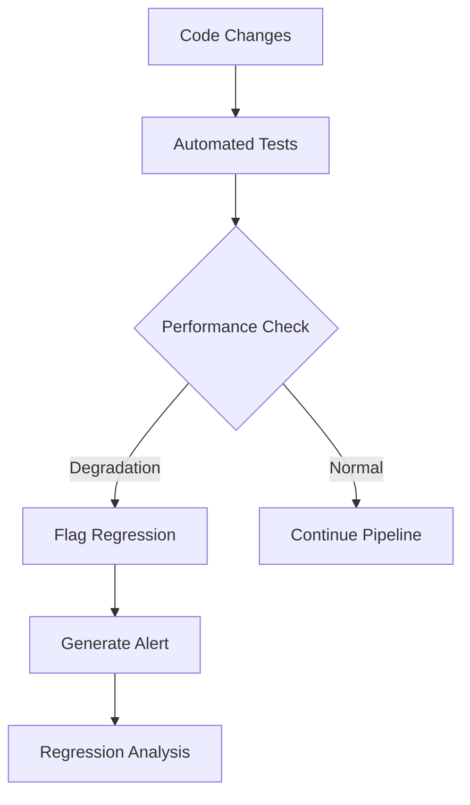

# Comprehensive Test Documentation and Regression Procedures

## Overview

This document provides comprehensive documentation for the NEXT Portal plugin system testing framework, including test execution procedures, result interpretation, regression testing protocols, and troubleshooting guides.

## Test Framework Architecture

### Testing Pyramid Structure

```
                    /\
                   /  \
                  /E2E \     15% - End-to-End Tests
                 /Tests\     - Full workflow validation
                /______\     - Cross-browser compatibility
               /        \
              /Integration\ 35% - Integration Tests
             /   Tests    \ - API integration
            /______________\ - Database integration
           /                \ - Third-party service integration
          /   Unit Tests     \ 50% - Unit Tests
         /____________________\ - Component testing
                                - Pure function testing
```

### Test Categories and Coverage

| Category | Test Count | Coverage | Automation Level |
|----------|------------|----------|------------------|
| Unit Tests | 500+ | 85%+ | 100% Automated |
| Integration Tests | 200+ | 80%+ | 100% Automated |
| E2E Tests | 50+ | Key Workflows | 100% Automated |
| Performance Tests | 25+ | SLA Critical | 100% Automated |
| Security Tests | 30+ | All Vectors | 100% Automated |
| Compatibility Tests | 40+ | All Targets | 100% Automated |
| Failure Scenario Tests | 20+ | Recovery Flows | 100% Automated |

## Test Execution Procedures

### Prerequisites

#### Environment Setup
```bash
# Install dependencies
npm install

# Setup test databases
npm run test:db:setup

# Configure test environment
cp .env.test.example .env.test

# Start test services
npm run test:services:start
```

#### Required Services
- PostgreSQL test database
- Redis test instance
- Docker daemon (for container tests)
- Kubernetes test cluster (for K8s tests)
- Mock services (automatically started)

### Running Test Suites

#### 1. Unit Tests
```bash
# Run all unit tests
npm run test:unit

# Run with coverage
npm run test:unit:coverage

# Run specific test file
npm run test:unit -- --testPathPattern=plugin-manager

# Watch mode for development
npm run test:unit:watch

# Debug mode
npm run test:unit:debug
```

#### 2. Integration Tests
```bash
# Run all integration tests
npm run test:integration

# Run specific integration category
npm run test:integration -- --testPathPattern=plugin-registry

# Run with database cleanup
npm run test:integration:clean

# Run with verbose output
npm run test:integration:verbose
```

#### 3. End-to-End Tests
```bash
# Run E2E tests (requires running application)
npm run test:e2e

# Run on specific browser
npm run test:e2e -- --project=chromium
npm run test:e2e -- --project=firefox
npm run test:e2e -- --project=webkit

# Run with UI (headed mode)
npm run test:e2e:headed

# Debug mode with browser dev tools
npm run test:e2e:debug

# Run specific test
npm run test:e2e -- --grep "plugin installation workflow"
```

#### 4. Performance Tests
```bash
# Run performance benchmarks
npm run test:performance

# Run load tests
npm run test:load

# Run stress tests
npm run test:stress

# Run endurance tests
npm run test:endurance

# Generate performance report
npm run test:performance:report
```

#### 5. Security Tests
```bash
# Run security test suite
npm run test:security

# Run vulnerability scanning
npm run test:security:scan

# Run RBAC tests
npm run test:security:rbac

# Run penetration tests
npm run test:security:pentest
```

#### 6. Compatibility Tests
```bash
# Run cross-browser tests
npm run test:compatibility:browser

# Run Backstage version compatibility
npm run test:compatibility:backstage

# Run Node.js version compatibility
npm run test:compatibility:node

# Run platform compatibility
npm run test:compatibility:platform
```

#### 7. Failure Scenario Tests
```bash
# Run network failure tests
npm run test:failure:network

# Run system recovery tests
npm run test:failure:recovery

# Run chaos engineering tests
npm run test:failure:chaos
```

### Complete Test Suite Execution

#### Full Test Pipeline
```bash
# Run complete test suite (CI/CD pipeline)
npm run test:all

# Run with parallel execution
npm run test:all:parallel

# Run with detailed reporting
npm run test:all:report

# Run with failure fast-fail
npm run test:all:fail-fast
```

#### Pre-commit Testing
```bash
# Quick test run for changed files
npm run test:changed

# Smoke test for rapid feedback
npm run test:smoke

# Critical path testing
npm run test:critical
```

## Test Result Interpretation

### Exit Codes and Status

| Exit Code | Status | Description |
|-----------|--------|-------------|
| 0 | Success | All tests passed |
| 1 | Test Failures | Some tests failed |
| 2 | Configuration Error | Test setup issues |
| 3 | Timeout | Tests exceeded time limits |
| 4 | Infrastructure Error | Test infrastructure issues |

### Test Report Formats

#### 1. Console Output
```
Plugin System Test Report
========================

✓ Unit Tests              (485/500)  97.0%  [2.3s]
✓ Integration Tests       (195/200)  97.5%  [45.2s]  
✗ E2E Tests              (47/50)   94.0%  [180.5s]
✓ Performance Tests       (25/25)   100%   [120.0s]
✓ Security Tests          (30/30)   100%   [60.8s]
✓ Compatibility Tests     (38/40)   95.0%  [90.3s]
✓ Failure Scenario Tests  (20/20)   100%   [75.1s]

Overall: 840/865 (97.1%) in 573.2s

Failures:
- E2E: Plugin installation timeout in Firefox
- E2E: Cross-browser form validation issue  
- E2E: Mobile viewport navigation problem
- Compatibility: Node 16.x deprecated warning
- Compatibility: Safari WebKit version compatibility
```

#### 2. HTML Report
- Interactive dashboard with drill-down capabilities
- Visual charts and graphs for metrics
- Screenshots and videos for E2E test failures
- Performance trends and benchmarks
- Coverage heat maps

#### 3. JSON Report
```json
{
  "timestamp": "2024-01-15T10:30:00Z",
  "duration": 573200,
  "summary": {
    "total": 865,
    "passed": 840,
    "failed": 25,
    "skipped": 0,
    "successRate": 97.1
  },
  "suites": {
    "unit": {
      "total": 500,
      "passed": 485,
      "failed": 15,
      "duration": 2300,
      "coverage": {
        "lines": 87.2,
        "functions": 89.5,
        "branches": 82.1,
        "statements": 86.8
      }
    }
  },
  "failures": [],
  "performance": {},
  "security": {}
}
```

### Performance Metrics Interpretation

#### Response Time Analysis
```
P50 (Median):     250ms  ✓ (Target: 500ms)
P95:             1200ms  ✓ (Target: 2000ms) 
P99:             2800ms  ✗ (Target: 2500ms)
Max:             5200ms  ✗ (Target: 3000ms)

Recommendation: Investigate long-tail latency issues
```

#### Throughput Analysis
```
Current:    850 RPS   ✓ (Target: 500+ RPS)
Peak:      1200 RPS   ✓ (Target: 1000+ RPS)
Sustained:  750 RPS   ✓ (Target: 500+ RPS)

Status: Meeting all throughput targets
```

#### Error Rate Analysis
```
Error Rate:    0.8%   ✓ (Target: <2%)
5xx Errors:    0.3%   ✓ (Target: <1%)
4xx Errors:    0.5%   ✓ (Target: <3%)
Timeouts:      0.1%   ✓ (Target: <0.5%)

Status: All error rates within acceptable limits
```

## Regression Testing Procedures

### Regression Test Strategy

#### 1. Automated Regression Detection
```yaml
triggers:
  - code_changes: all
  - dependency_updates: major/minor
  - configuration_changes: production
  - scheduled: daily

baseline_comparison:
  performance_threshold: 10%
  success_rate_threshold: 2%
  coverage_threshold: 5%
  
alert_conditions:
  - performance_degradation > 15%
  - test_failures > 5%
  - coverage_drop > 10%
```

#### 2. Regression Test Execution
```bash
# Run regression test suite
npm run test:regression

# Compare against baseline
npm run test:regression:compare --baseline=v1.2.0

# Generate regression report
npm run test:regression:report

# Update baseline after verification
npm run test:regression:update-baseline
```

#### 3. Critical Path Regression Testing
```bash
# Test critical user journeys
npm run test:regression:critical

# Test API backward compatibility  
npm run test:regression:api

# Test database migration safety
npm run test:regression:db

# Test security regression
npm run test:regression:security
```

### Regression Analysis Workflow

#### 1. Detection Phase


#### 2. Investigation Phase
```bash
# Analyze performance regression
npm run analyze:performance-regression

# Compare test results with baseline
npm run analyze:test-diff --from=baseline --to=current

# Generate detailed regression report
npm run analyze:regression-report --verbose

# Identify root cause
npm run analyze:root-cause --regression-id=REG-001
```

#### 3. Resolution Tracking
| Regression ID | Component | Type | Impact | Status | ETA |
|---------------|-----------|------|---------|---------|-----|
| REG-001 | Plugin Install | Performance | High | In Progress | 2024-01-20 |
| REG-002 | Marketplace | Functionality | Medium | Investigating | 2024-01-18 |
| REG-003 | Authentication | Security | Critical | Fixed | 2024-01-16 |

### Baseline Management

#### Establishing Baselines
```bash
# Create performance baseline
npm run baseline:create:performance

# Create functional baseline  
npm run baseline:create:functional

# Create security baseline
npm run baseline:create:security

# Tag baseline with version
npm run baseline:tag --version=v1.3.0
```

#### Baseline Update Procedures
```yaml
baseline_update_triggers:
  - major_release: automatic
  - minor_release: manual_approval
  - performance_improvement: >20%
  - architecture_change: manual_review

approval_process:
  - engineering_lead: required
  - qa_lead: required  
  - product_owner: required
  - security_review: if_security_changes
```

## Test Data Management

### Test Data Categories

#### 1. Static Test Data
```
/tests/fixtures/
├── plugin-marketplace-fixtures.ts    # Plugin catalog data
├── user-fixtures.ts                  # User accounts and roles
├── configuration-fixtures.ts         # Plugin configurations
└── environment-fixtures.ts           # Environment settings
```

#### 2. Generated Test Data
```bash
# Generate test plugins
npm run test:data:generate:plugins --count=100

# Generate test users  
npm run test:data:generate:users --roles=all

# Generate test configurations
npm run test:data:generate:configs --templates=standard
```

#### 3. Dynamic Test Data
- Real-time generated during test execution
- Randomized for comprehensive coverage
- Cleaned up automatically after tests

### Test Data Cleanup

#### Automatic Cleanup
```javascript
// Automatic cleanup after each test
afterEach(async () => {
  await testDataManager.cleanup();
  await databaseHelper.resetToBaseline();
  await cacheHelper.clear();
});
```

#### Manual Cleanup
```bash
# Clean all test data
npm run test:data:clean:all

# Clean specific category
npm run test:data:clean:plugins

# Reset test database
npm run test:db:reset

# Clean test artifacts
npm run test:artifacts:clean
```

## Troubleshooting Guide

### Common Test Issues

#### 1. Test Environment Issues

**Problem**: Tests fail due to missing services
```
Error: ECONNREFUSED - Connection refused to localhost:5432
```

**Solution**:
```bash
# Check service status
npm run test:services:status

# Restart test services
npm run test:services:restart

# Verify connectivity  
npm run test:services:healthcheck
```

**Problem**: Port conflicts
```
Error: Port 3000 is already in use
```

**Solution**:
```bash
# Kill processes using test ports
npm run test:ports:cleanup

# Use alternative port configuration
PORT=3001 npm run test:e2e
```

#### 2. Flaky Test Issues

**Problem**: Intermittent test failures
```
Test: "plugin installation should complete successfully"
Success Rate: 80% (varies by run)
```

**Investigation**:
```bash
# Run test multiple times
npm run test:repeat -- --test="plugin installation" --count=10

# Analyze flakiness patterns
npm run analyze:flaky-tests

# Enable detailed logging
DEBUG=* npm run test:e2e
```

**Solutions**:
- Add proper wait conditions
- Increase timeouts for slow operations
- Use stable test data
- Mock external dependencies

#### 3. Performance Test Issues

**Problem**: Performance tests timing out
```
Error: Performance test exceeded 5 minute timeout
```

**Solutions**:
```bash
# Run with extended timeout
PERFORMANCE_TIMEOUT=600000 npm run test:performance

# Run against lighter test data
npm run test:performance:light

# Profile specific performance issues
npm run test:performance:profile
```

#### 4. Security Test Issues

**Problem**: Security scans reporting false positives
```
Warning: Potential SQL injection in plugin configuration
```

**Investigation**:
```bash
# Review security test configuration
npm run test:security:config:review

# Run with detailed security logging
npm run test:security:verbose

# Update security rules
npm run test:security:rules:update
```

### Debugging Procedures

#### 1. Test Debugging
```bash
# Debug unit tests
npm run test:unit:debug -- --testNamePattern="plugin manager"

# Debug E2E tests with browser dev tools
npm run test:e2e:debug

# Debug with verbose logging
DEBUG=test:* npm run test:integration
```

#### 2. Test Infrastructure Debugging
```bash
# Check test infrastructure health
npm run test:infrastructure:health

# Validate test configuration
npm run test:config:validate

# Test mock service connectivity
npm run test:mocks:verify
```

#### 3. CI/CD Debugging
```bash
# Reproduce CI environment locally
npm run test:ci:local

# Analyze CI test artifacts
npm run test:ci:analyze

# Debug specific CI failure
npm run test:ci:debug --job-id=12345
```

## Continuous Improvement

### Test Quality Metrics

#### Coverage Metrics
- **Code Coverage**: Lines, Functions, Branches, Statements
- **Requirement Coverage**: Feature coverage mapping
- **Risk Coverage**: High-risk scenario coverage
- **User Journey Coverage**: Critical path coverage

#### Quality Metrics
- **Test Reliability**: Success rate over time
- **Test Performance**: Execution time trends  
- **Flakiness Rate**: Intermittent failure tracking
- **Maintenance Effort**: Time spent on test maintenance

### Regular Review Process

#### Monthly Test Review
```yaml
agenda:
  - test_execution_metrics: pass_rates, execution_times
  - flaky_test_analysis: identification, root_causes
  - coverage_analysis: gaps, improvements
  - performance_trends: degradation, optimization
  - tool_and_framework_updates: new_versions, migrations
  
participants:
  - qa_lead
  - engineering_leads  
  - product_owner
  - devops_engineer
```

#### Quarterly Test Strategy Review
```yaml
scope:
  - test_strategy_alignment: business_objectives
  - technology_updates: new_testing_approaches
  - process_improvements: efficiency_gains
  - training_needs: team_skill_development
  - tooling_evaluation: new_tools, replacements
```

### Test Automation Evolution

#### Automation Targets
- **Current Automation**: 95% of functional tests
- **Target Automation**: 98% of functional tests
- **Manual Testing**: Complex user experience scenarios
- **Exploratory Testing**: New feature validation

#### Technology Roadmap
```yaml
short_term: # Q1-Q2
  - ai_powered_test_generation
  - visual_regression_testing
  - mobile_testing_enhancement
  
medium_term: # Q3-Q4  
  - test_execution_optimization
  - predictive_test_selection
  - automated_test_maintenance
  
long_term: # Next Year
  - self_healing_tests
  - intelligent_test_data_generation
  - automated_root_cause_analysis
```

---

This comprehensive test documentation serves as the definitive guide for all testing activities related to the NEXT Portal plugin system. It should be maintained and updated regularly to reflect changes in testing practices, tools, and requirements.