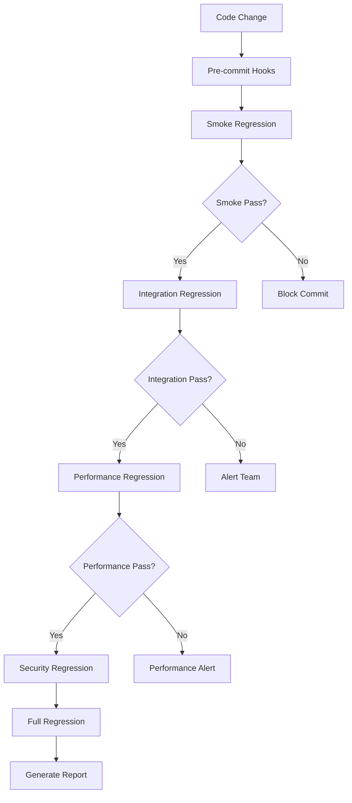
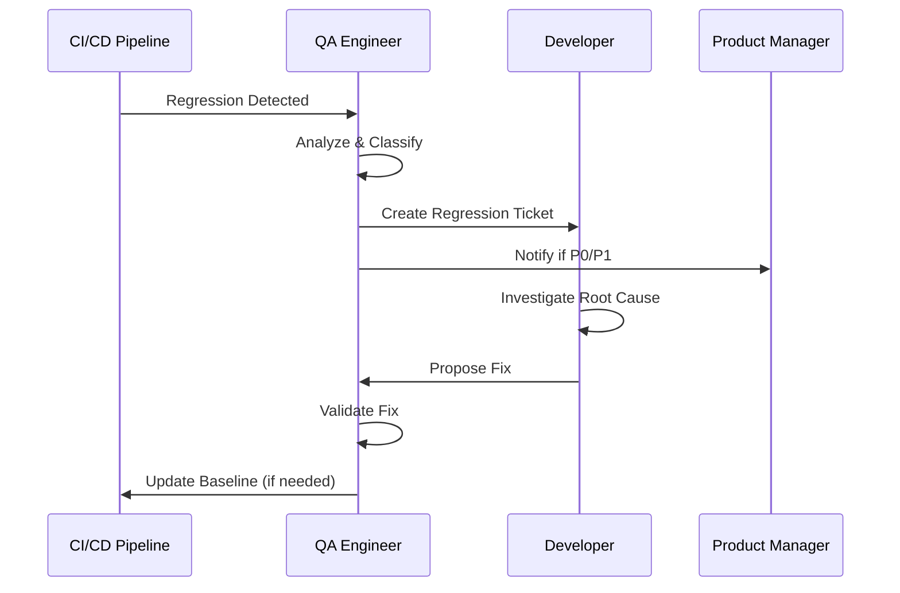

# Regression Testing Procedures

## Overview

This document outlines comprehensive regression testing procedures for the NEXT Portal plugin system to ensure that new changes do not negatively impact existing functionality, performance, or security.

## Regression Testing Strategy

### Definition and Scope

**Regression Testing** is the practice of re-running functional and non-functional tests to ensure that previously developed and tested software still performs correctly after changes.

**Scope of Regression Testing:**
- All existing functionality remains intact
- Performance characteristics are maintained
- Security posture is not compromised
- Integration points continue to function
- User experience consistency is preserved

### Regression Test Pyramid

```
             /\
            /  \
           /E2E \ 
          /Regr.\ ← 10% - Critical user journeys
         /______\
        /        \
       /Integration\ ← 30% - API contracts & service integration
      / Regression \
     /______________\
    /                \
   /   Unit Tests     \ ← 60% - Component behavior verification
  / Regression Suite  \
 /____________________\
```

## Regression Test Categories

### 1. Functional Regression Tests

#### Core Functionality Tests
```yaml
test_categories:
  plugin_lifecycle:
    - plugin_discovery
    - plugin_installation  
    - plugin_configuration
    - plugin_updates
    - plugin_removal
    
  user_management:
    - authentication
    - authorization
    - role_management
    - permission_validation
    
  marketplace:
    - catalog_browsing
    - search_functionality
    - filtering_sorting
    - plugin_details
    
  system_integration:
    - backstage_integration
    - database_operations
    - external_api_calls
    - container_orchestration
```

#### Test Execution Matrix
| Component | Smoke Test | Full Regression | Critical Path |
|-----------|------------|-----------------|---------------|
| Plugin Manager | ✓ | ✓ | ✓ |
| Marketplace | ✓ | ✓ | ✓ |
| Authentication | ✓ | ✓ | ✓ |
| Configuration | ✓ | ✓ | - |
| Monitoring | ✓ | ✓ | - |
| Reporting | - | ✓ | - |

### 2. Performance Regression Tests

#### Performance Baseline Tracking
```javascript
const performanceBaselines = {
  marketplaceLoadTime: {
    baseline: 2800, // ms
    threshold: 10,  // % degradation allowed
    alertThreshold: 20 // % degradation for alerts
  },
  pluginInstallTime: {
    baseline: 180000, // ms (3 minutes)
    threshold: 15,
    alertThreshold: 25
  },
  apiResponseTime: {
    baseline: 250, // ms
    threshold: 20,
    alertThreshold: 35
  },
  searchResponseTime: {
    baseline: 400, // ms
    threshold: 15,
    alertThreshold: 30
  }
};
```

#### Performance Regression Detection
```bash
# Run performance regression suite
npm run test:regression:performance

# Compare against baseline
npm run test:performance:compare --baseline=v1.2.0 --current=HEAD

# Generate performance regression report  
npm run test:performance:regression-report
```

### 3. Security Regression Tests

#### Security Test Categories
```yaml
authentication_security:
  - session_management
  - password_policies
  - multi_factor_authentication
  - token_validation

authorization_security:
  - role_based_access_control
  - permission_boundaries
  - privilege_escalation_prevention
  - resource_access_validation

plugin_security:
  - plugin_sandboxing
  - resource_isolation
  - network_policies
  - file_system_access

data_security:
  - encryption_at_rest
  - encryption_in_transit
  - data_masking
  - audit_logging
```

#### Security Regression Automation
```bash
# Run security regression tests
npm run test:regression:security

# Vulnerability scan regression
npm run test:security:vulnerability-scan --compare-baseline

# RBAC regression validation
npm run test:security:rbac --regression-mode

# Plugin security isolation tests
npm run test:security:plugin-isolation --regression
```

### 4. Integration Regression Tests

#### External Service Integration
```yaml
backstage_integration:
  - catalog_api_compatibility
  - authentication_integration
  - plugin_loading_mechanism
  - theme_integration

container_runtime:
  - docker_api_compatibility
  - kubernetes_api_compatibility
  - resource_management
  - networking_configuration

database_integration:
  - schema_compatibility
  - query_performance
  - transaction_handling
  - connection_pooling

third_party_services:
  - monitoring_systems
  - logging_aggregation
  - notification_services
  - external_registries
```

## Regression Test Execution Workflows

### 1. Automated Regression Execution

#### Trigger Conditions
```yaml
automatic_triggers:
  code_changes:
    - main_branch: full_regression
    - feature_branch: smoke_regression
    - release_branch: comprehensive_regression
    
  scheduled_execution:
    - daily: smoke_tests
    - weekly: full_regression  
    - monthly: comprehensive_regression
    
  dependency_updates:
    - major_version: full_regression
    - minor_version: integration_regression
    - patch_version: smoke_regression

configuration_changes:
  - production_config: full_regression
  - staging_config: integration_regression
  - feature_flags: targeted_regression
```

#### Execution Pipeline


### 2. Manual Regression Execution

#### Pre-release Regression Testing
```bash
# Complete pre-release regression suite
npm run test:regression:pre-release

# Generate comprehensive regression report
npm run test:regression:report --format=html,json,pdf

# Validate against release criteria
npm run test:regression:validate-release-criteria
```

#### Critical Bug Fix Regression
```bash
# Targeted regression for specific component
npm run test:regression:targeted --component=plugin-installer

# Validate fix doesn't break related functionality
npm run test:regression:impact-analysis --change-set=bugfix-123

# Quick smoke test for urgent fixes
npm run test:regression:smoke --fast-mode
```

### 3. Regression Test Result Analysis

#### Automated Analysis Pipeline
```javascript
class RegressionAnalyzer {
  async analyzeResults(currentResults, baselineResults) {
    const analysis = {
      functionalRegressions: this.detectFunctionalRegressions(currentResults, baselineResults),
      performanceRegressions: this.detectPerformanceRegressions(currentResults, baselineResults),
      securityRegressions: this.detectSecurityRegressions(currentResults, baselineResults),
      newFailures: this.identifyNewFailures(currentResults, baselineResults),
      fixedIssues: this.identifyFixedIssues(currentResults, baselineResults)
    };
    
    return this.generateRegressionReport(analysis);
  }
  
  detectFunctionalRegressions(current, baseline) {
    return current.functionalTests.filter(test => 
      test.status === 'failed' && 
      baseline.functionalTests.find(b => b.name === test.name)?.status === 'passed'
    );
  }
  
  detectPerformanceRegressions(current, baseline) {
    const regressions = [];
    
    for (const metric of current.performanceMetrics) {
      const baselineMetric = baseline.performanceMetrics.find(b => b.name === metric.name);
      if (baselineMetric) {
        const degradation = ((metric.value - baselineMetric.value) / baselineMetric.value) * 100;
        if (degradation > performanceBaselines[metric.name]?.threshold) {
          regressions.push({
            metric: metric.name,
            current: metric.value,
            baseline: baselineMetric.value,
            degradation: degradation,
            severity: degradation > performanceBaselines[metric.name]?.alertThreshold ? 'high' : 'medium'
          });
        }
      }
    }
    
    return regressions;
  }
}
```

## Regression Test Data Management

### Test Data Strategy for Regression Testing

#### Baseline Test Data
```yaml
data_categories:
  static_data:
    - reference_plugins: frozen_set_of_100_plugins
    - user_accounts: standardized_user_roles
    - configurations: validated_config_templates
    
  versioned_data:
    - schema_versions: database_migration_data
    - api_contracts: versioned_api_responses
    - feature_flags: environment_configurations
    
  dynamic_data:
    - generated_test_data: reproducible_random_data
    - time_dependent_data: consistent_timestamps
    - external_data: mocked_external_services
```

#### Data Consistency Validation
```bash
# Validate test data consistency
npm run test:data:validate-consistency

# Compare data across test runs
npm run test:data:compare --run1=baseline --run2=current

# Reset test data to known state
npm run test:data:reset --to-baseline
```

### Test Environment Management

#### Environment Isolation
```yaml
regression_environments:
  baseline_environment:
    purpose: maintains_known_good_state
    update_frequency: monthly_with_releases
    data_refresh: weekly
    
  current_environment:  
    purpose: tests_latest_changes
    update_frequency: continuous_integration
    data_refresh: per_test_run
    
  comparison_environment:
    purpose: side_by_side_comparison
    update_frequency: on_demand
    data_refresh: synchronized_with_baseline
```

#### Environment Provisioning
```bash
# Provision baseline environment
npm run env:provision:baseline --version=v1.2.0

# Provision current environment
npm run env:provision:current --branch=main

# Synchronize environments
npm run env:sync --from=baseline --to=current
```

## Regression Issue Management

### Regression Classification

#### Severity Levels
| Level | Definition | Response Time | Resolution Time |
|-------|------------|---------------|-----------------|
| P0 - Critical | System unusable, data loss | 1 hour | 4 hours |
| P1 - High | Major feature broken | 4 hours | 1 day |
| P2 - Medium | Minor feature impact | 1 day | 3 days |
| P3 - Low | Cosmetic or edge case | 1 week | 2 weeks |

#### Impact Assessment Matrix
```yaml
impact_factors:
  user_experience:
    - critical_user_journey_blocked: P0
    - major_feature_impacted: P1
    - minor_feature_affected: P2
    - cosmetic_issue: P3
    
  business_impact:
    - revenue_affecting: P0
    - customer_satisfaction: P1  
    - operational_efficiency: P2
    - nice_to_have: P3
    
  technical_impact:
    - system_stability: P0
    - performance_degradation: P1
    - integration_issues: P2
    - code_quality: P3
```

### Regression Workflow

#### Detection to Resolution Process


#### Regression Tracking Template
```markdown
# Regression Report: REG-2024-001

## Summary
- **Component**: Plugin Installer
- **Severity**: P1 - High
- **Detected**: 2024-01-15 14:30 UTC
- **Reporter**: CI/CD Pipeline
- **Assignee**: @developer-team

## Details
- **Baseline Version**: v1.2.0
- **Current Version**: v1.3.0-rc1
- **Test Case**: plugin-installation-workflow.spec.ts
- **Failure Rate**: 15% (3 out of 20 runs)

## Impact Assessment
- **User Impact**: Plugin installation fails intermittently
- **Business Impact**: Affects new user onboarding
- **Technical Impact**: Installation service reliability

## Root Cause Analysis
- [ ] Code changes review
- [ ] Dependency updates analysis  
- [ ] Infrastructure changes review
- [ ] Test environment validation

## Resolution Plan
- [ ] Identify root cause
- [ ] Implement fix
- [ ] Validate fix in test environment
- [ ] Update regression tests
- [ ] Deploy to staging
- [ ] Validate in staging
- [ ] Deploy to production

## Prevention Measures
- [ ] Add specific regression test
- [ ] Update CI/CD validation
- [ ] Improve monitoring
- [ ] Update documentation
```

## Continuous Improvement

### Regression Test Optimization

#### Test Suite Optimization
```javascript
const optimizationStrategies = {
  testSelection: {
    riskBasedSelection: 'select_tests_based_on_change_impact',
    historicalAnalysis: 'prioritize_frequently_failing_areas',
    codeGoverage: 'ensure_changed_code_is_tested'
  },
  
  testExecution: {
    parallelization: 'run_independent_tests_in_parallel',
    testSharding: 'distribute_tests_across_multiple_runners',
    smartRetries: 'retry_only_flaky_tests_with_backoff'
  },
  
  testMaintenance: {
    automaticUpdates: 'update_tests_based_on_API_changes',
    deadCodeRemoval: 'remove_tests_for_deprecated_features',
    testRefactoring: 'consolidate_duplicate_test_scenarios'
  }
};
```

#### Performance Monitoring
```bash
# Monitor regression test performance
npm run test:regression:monitor

# Analyze test execution trends
npm run test:regression:analyze-trends

# Optimize slow regression tests
npm run test:regression:optimize --slow-tests-only
```

### Metrics and Reporting

#### Key Regression Metrics
```yaml
effectiveness_metrics:
  regression_detection_rate: 95%  # Percentage of regressions caught
  false_positive_rate: 5%        # Invalid regression alerts
  time_to_detection: 30_minutes  # Average detection time
  resolution_time: 4_hours       # Average fix time

efficiency_metrics:
  test_execution_time: 45_minutes # Full regression suite
  resource_utilization: 70%      # CI/CD resource usage
  test_maintenance_effort: 2_hours_per_week
  automation_coverage: 95%       # Automated vs manual
  
quality_metrics:
  test_reliability: 98%          # Non-flaky test percentage
  baseline_accuracy: 99%         # Baseline represents truth
  environment_consistency: 95%   # Env parity with production
```

#### Regression Dashboard
- Real-time regression test status
- Historical trend analysis
- Performance regression tracking
- Security regression monitoring
- Integration regression status
- Test coverage regression

### Future Enhancements

#### Intelligent Regression Testing
```yaml
ai_powered_features:
  predictive_test_selection:
    - analyze_code_changes_to_predict_impact_areas
    - machine_learning_based_test_prioritization
    - dynamic_test_suite_generation
    
  automated_root_cause_analysis:
    - analyze_failure_patterns_automatically  
    - suggest_potential_root_causes
    - recommend_investigation_steps
    
  self_healing_tests:
    - automatically_update_tests_for_UI_changes
    - adapt_to_API_contract_modifications
    - maintain_test_data_consistency
```

---

This regression testing procedure document provides a comprehensive framework for maintaining software quality through systematic regression testing. It should be reviewed and updated regularly to incorporate lessons learned and evolving best practices.