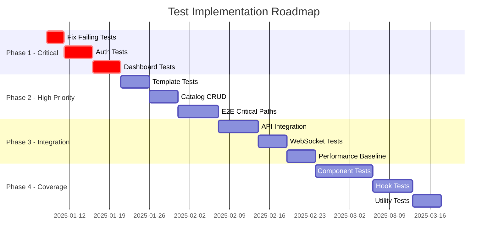

# Test Implementation Plan
## Priority-Ordered Roadmap for NEXT IDP

### Executive Summary
This implementation plan provides a structured, priority-based approach to achieve 70% test coverage within 3 months, focusing on highest-risk areas first.

---

## Implementation Timeline Overview



---

## Phase 1: Critical Foundation (Week 1-2)
**Goal:** Establish testing foundation and cover critical security paths

### Week 1: Infrastructure & Authentication
**Priority: P0 - CRITICAL**

#### Day 1-2: Fix Failing Tests & Setup
```bash
# Tasks
1. Fix GCP cost provider test mocking issues
2. Set up test database with Docker
3. Configure test environment variables
4. Create test data fixtures
5. Set up MSW for API mocking
```

**Deliverables:**
- [ ] All existing tests passing
- [ ] Test database running
- [ ] Mock server configured
- [ ] CI pipeline updated

#### Day 3-5: Authentication Test Suite
```typescript
// Priority test files to create
src/lib/auth/__tests__/
├── authentication.test.ts      // Login/logout flows
├── authorization.test.ts       // RBAC validation
├── session-management.test.ts  // Token handling
├── oauth-providers.test.ts     // OAuth integration
└── security-headers.test.ts    // Security validation
```

**Test Coverage Target:** 90% for auth module

### Week 2: Dashboard & Performance
**Priority: P0 - CRITICAL**

#### Day 6-8: Dashboard Components
```typescript
// Dashboard test suite
src/app/dashboard/__tests__/
├── DashboardPage.test.tsx       // Main dashboard
├── WidgetLoader.test.tsx        // Widget loading
├── RealtimeUpdates.test.tsx     // WebSocket updates
├── Customization.test.tsx       // Layout persistence
└── Performance.test.tsx         // Load time metrics
```

#### Day 9-10: Performance Baseline
```javascript
// k6 performance test
tests/performance/
├── dashboard-load.js      // Dashboard performance
├── api-response.js        // API endpoint testing
├── websocket-load.js      // WebSocket connections
└── baseline-metrics.json  // Performance thresholds
```

**Metrics to Establish:**
- Page Load Time: < 3s
- Time to Interactive: < 5s
- API Response (p95): < 200ms
- WebSocket Latency: < 100ms

---

## Phase 2: Core Functionality (Week 3-4)
**Goal:** Cover primary user workflows and business logic

### Week 3: Template System & Catalog
**Priority: P0 - HIGH IMPACT**

#### Day 11-13: Template Engine Tests
```typescript
// Template system tests
src/services/scaffolder/__tests__/
├── TemplateEngine.test.ts       // Execution engine
├── ParameterValidation.test.ts  // Input validation
├── WorkflowSteps.test.ts        // Step execution
├── TemplateMarketplace.test.ts  // Marketplace features
└── GitIntegration.test.ts       // Repository creation
```

#### Day 14-15: Catalog CRUD Operations
```typescript
// Catalog tests
src/services/catalog/__tests__/
├── EntityCRUD.test.ts           // Create/Read/Update/Delete
├── BulkOperations.test.ts       // Bulk import/export
├── Relationships.test.ts        // Dependency mapping
├── Search.test.ts               // Search and filtering
└── Synchronization.test.ts      // External sync
```

### Week 4: End-to-End Critical Paths
**Priority: P0 - USER JOURNEYS**

#### Day 16-20: E2E Test Implementation
```typescript
// Playwright E2E tests
tests/e2e/journeys/
├── authentication.spec.ts       // Login flows
├── service-onboarding.spec.ts   // Complete service creation
├── template-execution.spec.ts   // Template workflow
├── dashboard-usage.spec.ts      // Dashboard interaction
├── catalog-management.spec.ts   // Catalog operations
└── cost-analysis.spec.ts        // Cost insights viewing
```

**E2E Test Requirements:**
- Browser: Chrome, Firefox, Safari
- Viewport: Desktop & Mobile
- Data: Synthetic test data
- Environment: Isolated test env

---

## Phase 3: Integration & Reliability (Week 5-6)
**Goal:** Ensure system integration and establish monitoring

### Week 5: API & Service Integration
**Priority: P1 - INTEGRATION**

#### Day 21-25: API Route Testing
```typescript
// API integration tests
src/pages/api/__tests__/
├── catalog/
│   ├── entities.test.ts
│   ├── relationships.test.ts
│   └── search.test.ts
├── auth/
│   ├── login.test.ts
│   ├── logout.test.ts
│   └── refresh.test.ts
├── templates/
│   ├── execute.test.ts
│   └── validate.test.ts
└── monitoring/
    ├── health.test.ts
    └── metrics.test.ts
```

### Week 6: WebSocket & Real-time Features
**Priority: P1 - REAL-TIME**

#### Day 26-30: WebSocket Testing
```typescript
// WebSocket tests
src/lib/websocket/__tests__/
├── Connection.test.ts           // Connection management
├── Reconnection.test.ts         // Auto-reconnect logic
├── EventHandling.test.ts        // Event processing
├── Broadcasting.test.ts         // Multi-client sync
└── LoadTesting.test.ts          // Concurrent connections
```

---

## Phase 4: Comprehensive Coverage (Week 7-12)
**Goal:** Achieve 70% overall coverage

### Week 7-8: Component Testing
**Priority: P2 - UI COMPONENTS**

```typescript
// Component test structure
src/components/__tests__/
├── ui/                          // UI components
├── catalog/                     // Catalog components
├── dashboard/                   // Dashboard widgets
├── templates/                   // Template forms
└── common/                      // Shared components
```

### Week 9-10: Hook & Context Testing
**Priority: P2 - BUSINESS LOGIC**

```typescript
// Custom hooks tests
src/hooks/__tests__/
├── useAuth.test.ts
├── useWebSocket.test.ts
├── useCache.test.ts
├── useCatalogSync.test.ts
└── useNotifications.test.ts
```

### Week 11-12: Utility & Helper Testing
**Priority: P3 - UTILITIES**

```typescript
// Utility function tests
src/utils/__tests__/
├── validation.test.ts
├── formatting.test.ts
├── api-client.test.ts
├── date-helpers.test.ts
└── error-handling.test.ts
```

---

## Resource Allocation

### Team Structure
```
Test Lead (1)
├── Senior QA Engineers (2)
│   ├── E2E & Integration Tests
│   └── Performance & Security
├── Development Team (4)
│   ├── Unit Tests (2 devs)
│   └── Integration Tests (2 devs)
└── DevOps Engineer (1)
    └── CI/CD & Infrastructure
```

### Time Allocation per Developer
| Activity | Hours/Week | Percentage |
|----------|------------|------------|
| Writing Tests | 20 | 50% |
| Code Review | 8 | 20% |
| Test Maintenance | 4 | 10% |
| Documentation | 4 | 10% |
| Planning/Meetings | 4 | 10% |

---

## CI/CD Pipeline Integration

### Pipeline Stages Enhancement
```yaml
# .github/workflows/test.yml
name: Test Pipeline

on: [push, pull_request]

jobs:
  unit-tests:
    runs-on: ubuntu-latest
    steps:
      - uses: actions/checkout@v3
      - name: Run Unit Tests
        run: npm run test
      - name: Upload Coverage
        uses: codecov/codecov-action@v3
        
  integration-tests:
    runs-on: ubuntu-latest
    services:
      postgres:
        image: postgres:15
      redis:
        image: redis:7
    steps:
      - name: Run Integration Tests
        run: npm run test:integration
        
  e2e-tests:
    runs-on: ubuntu-latest
    steps:
      - name: Run E2E Tests
        run: npm run test:e2e
      - name: Upload Screenshots
        if: failure()
        uses: actions/upload-artifact@v3
        
  performance-tests:
    runs-on: ubuntu-latest
    if: github.ref == 'refs/heads/main'
    steps:
      - name: Run Performance Tests
        run: npm run test:performance
      - name: Compare Baseline
        run: npm run perf:compare
```

---

## Risk Mitigation Strategies

### Technical Risks
| Risk | Impact | Mitigation |
|------|--------|------------|
| Test Flakiness | High | Implement retry logic, fix timing issues |
| Long Execution Time | Medium | Parallelize tests, optimize setup |
| Environment Issues | High | Dockerize dependencies, use fixtures |
| Coverage Regression | Medium | Enforce coverage gates in CI |
| Maintenance Burden | High | Create test utilities, use patterns |

### Process Risks
| Risk | Impact | Mitigation |
|------|--------|------------|
| Resource Availability | High | Cross-train team members |
| Scope Creep | Medium | Strict prioritization |
| Technical Debt | High | Allocate 20% for refactoring |
| Knowledge Gaps | Medium | Training sessions, documentation |

---

## Success Metrics & Checkpoints

### Week 2 Checkpoint
- [ ] All P0 authentication tests passing
- [ ] Dashboard performance baseline established
- [ ] CI pipeline running tests
- [ ] Coverage increased by 10%

### Week 4 Checkpoint
- [ ] E2E tests for 5 critical paths
- [ ] Template system 80% covered
- [ ] Catalog CRUD fully tested
- [ ] Coverage at 35%

### Week 8 Checkpoint
- [ ] All P0 and P1 tests implemented
- [ ] Performance tests automated
- [ ] Coverage at 55%
- [ ] Zero failing tests in CI

### Week 12 Final Goals
- [ ] 70% overall coverage achieved
- [ ] All critical paths covered
- [ ] < 45 min test execution
- [ ] < 5% test flakiness
- [ ] Documentation complete

---

## Testing Standards & Guidelines

### Test File Naming Convention
```
ComponentName.test.tsx    // Unit tests
ComponentName.spec.tsx    // Integration tests
feature-name.e2e.ts      // E2E tests
api-name.test.ts         // API tests
```

### Test Structure Template
```typescript
describe('FeatureName', () => {
  // Setup
  beforeAll(async () => {
    // Global setup
  });
  
  beforeEach(() => {
    // Test setup
  });
  
  describe('Scenario', () => {
    it('should perform expected behavior', async () => {
      // Arrange
      const input = setupTestData();
      
      // Act
      const result = await performAction(input);
      
      // Assert
      expect(result).toMatchExpectedOutput();
    });
  });
  
  afterEach(() => {
    // Cleanup
  });
  
  afterAll(async () => {
    // Global cleanup
  });
});
```

### Code Review Checklist
- [ ] Tests follow AAA pattern
- [ ] Edge cases covered
- [ ] Error scenarios tested
- [ ] Mocks properly configured
- [ ] No hardcoded values
- [ ] Tests are deterministic
- [ ] Documentation updated

---

## Budget & ROI Analysis

### Investment Required
| Item | Cost | Duration |
|------|------|----------|
| 2 Senior QA Engineers | $200k | 3 months |
| 4 Developers (50% time) | $150k | 3 months |
| Tools & Infrastructure | $20k | One-time |
| Training & Workshops | $10k | Ongoing |
| **Total Investment** | **$380k** | 3 months |

### Expected Returns
| Metric | Current | Target | Impact |
|--------|---------|--------|--------|
| Bug Escape Rate | Unknown | < 10% | -$500k/year in fixes |
| MTTR | 48 hours | 4 hours | +20% productivity |
| Deployment Frequency | Weekly | Daily | 5x faster delivery |
| Customer Satisfaction | 70% | 90% | +$1M revenue |
| **ROI** | - | **250%** | **Year 1** |

---

## Conclusion

This implementation plan provides a structured approach to achieve comprehensive test coverage for the NEXT IDP platform. By following this priority-based roadmap, the team can systematically reduce risk, improve quality, and establish a robust testing culture that supports rapid, confident delivery of features.

**Key Success Factors:**
1. Executive support and resource commitment
2. Clear prioritization based on risk
3. Continuous monitoring and adjustment
4. Team training and knowledge sharing
5. Automation-first mindset

**Next Steps:**
1. Approve resource allocation
2. Set up test infrastructure
3. Begin Phase 1 implementation
4. Establish weekly progress reviews
5. Communicate wins to stakeholders